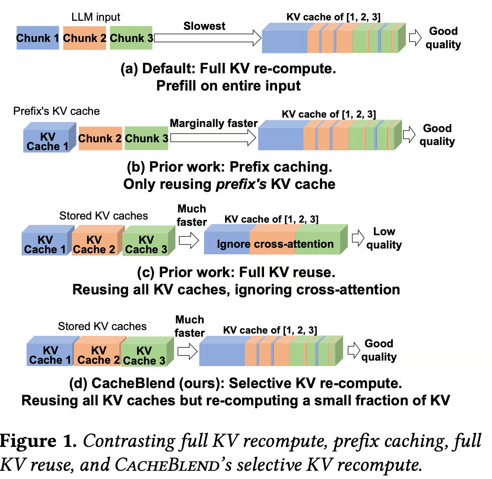
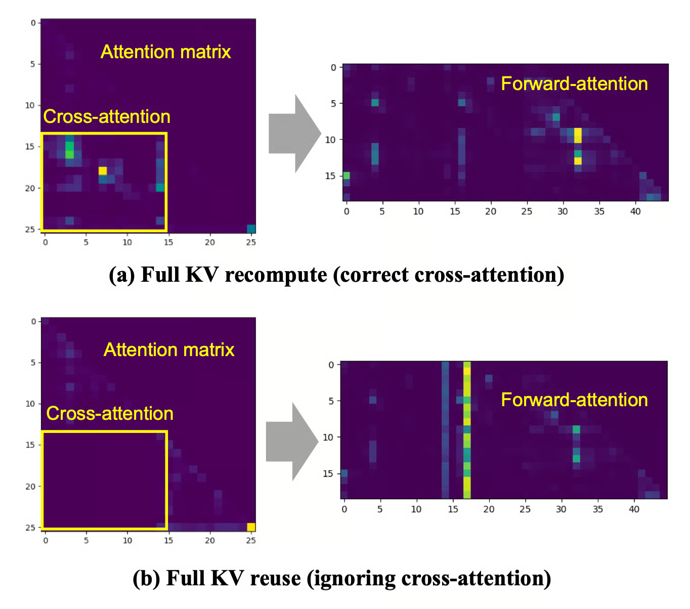

+++
title = "CacheBlend"
slug = "cache-blend"
+++

[CacheBlend: Fast Large Language Model Serving for RAG with Cached Knowledge Fusion](https://arxiv.org/abs/2405.16444)

## Problem
There are many existing inference runtime that utilize KV cache reusing. This KV cache reusing shorten the computation cost and time during prefilling phase. However, existing methods cannot be applied when RAG is used.

> **RAG**
>
> RAG is 'Retreival Augmented Generation'. It adds several prefix chunks to the user sequence, and generate the output sequence. It uses sentence embedding to find appropriate prefix chunks for given user sequence.

If you look at the figure above,
At (a),  default LLMs fully re-compute KV cache at prefilling phase.

At (b), it only reuse the KV cache of first chunk.

At (c), it utilize KV cache of all the chunks, but they aren't cross-attentioned. So the output quality becomes really poor.

At (d), paper propose new method that reuse KV cache of all the chunks and also apply cross-attention in negligible overhead.

## Solution
The main problem is that we should apply cross-attention between prefix chunk's KV cache. And fully doing cross-attention is just the case (a).

In this paper, it starts with a following idea:

> If we want to fuse KV-cache-1 and KV-cache-2, we select few(15%) tokens from chunk-1. Apply cross-attention between selected tokens from chunk-1 and all tokens in chunk-2.

If we could select important tokens from chunk-1, we can apply effective cross-attention that outputs KV cache similar to `Full re-compute KV cache`.

## How can we choose important tokens?
To answer this question, we have to take a look at case (c).

Case (c) outputs poor quality result because it's KV cache has huge gap with case (a)'s KV cache.

As a result, it doesn't properly link the meaning between prefix chunks. If you look at attention matrix in figure below, the cross-attention part between prefix chunks are all 0's.

So the paper came up with the following idea:
> We should make the KV-cache similar to full recomputed KV cache. (without fully recomputing)

The term important token  means tokens with largest KV deviation.
> KV deviation means gap between outputed KV cache and full recomputed KV cache.

Picking tokens that has huge gap between ideal one(full recomputed KV cache), and update via cross-attention will be the solution.

But this doesn't make sense. To calculate gap between ideal one, we should know the ideal one. Eventually doing full recomputation of KV cache. However, the paper suggest a clever thought:

> Tokens with the highest KV deviations on one layer are likely to have the highest KV deviations on the next layer.

As adding up KV cache by fusing KV-caches, we can calculate how much KV cache changed. Then we can calculate the 15% HKVD(Highest KV Deviation) tokens and apply cross-attention.

## Pipelining to hide recompute time
As we reuse KV cache, there is a step of loading KV cache to GPU. If we pipeline the KV cache loading and KV cache recompute, then we can hide the recompute time.

The paper suggest selecting 15% of tokens for cross-attention during fusion will hide the recompute time.
