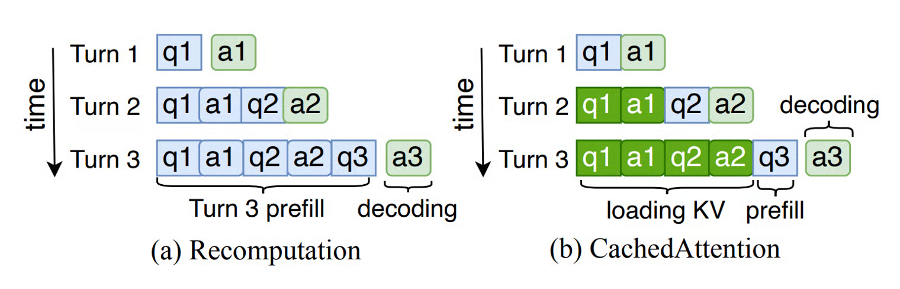
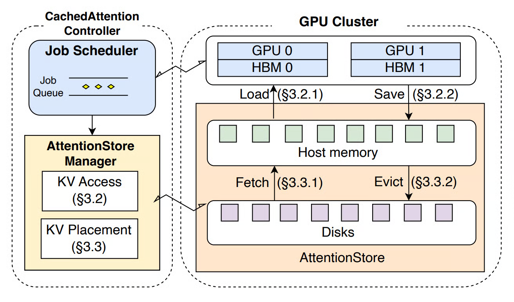
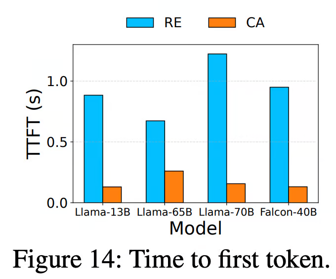
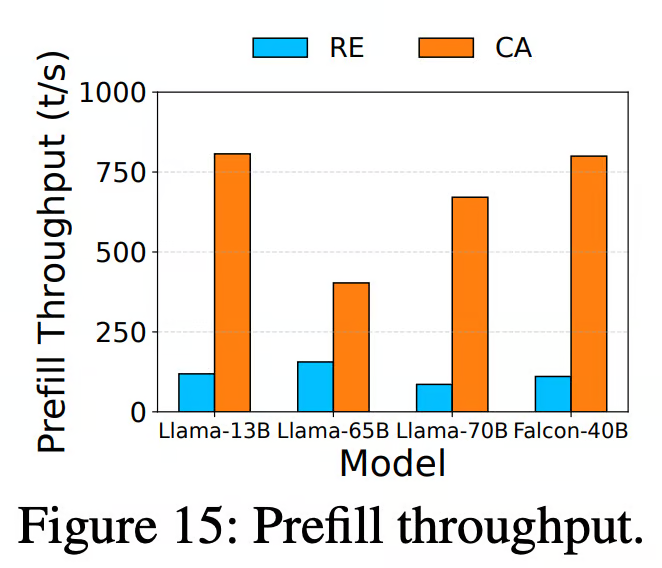

+++
title = "CachedAttention"
slug = "cached-attention"
+++

## Summary
This paper propose a KV caching system to reduce the computation during LLM inference.

## Background
The paper distinguishes LLM inferencing into two phases:

1. Prefilling: Making KV caches for previous prompts + Generate the next token
2. Decoding: Making KV cache for generated token + Generate the next token

The inference engine first do the prefilling-phase. And then iterate decoding-phase until it outputs EOF token or reaches maximum generation length.

## Problem proposal

Most of realworld tasks handle multi-turn conversations. And this is the part that problem happens.

For every future turn(Turn 2, Turn 3, ...), it should do the prefilling-phase again. Which is just a duplicate computation. As the conversation length gets bigger and bigger, recomputation cost in prefilling-phase takes 99% of the inference computation.

## Contribution

The paper suggests a solution for the problem, `CachedAttention`
1. Cache the previous KV values, and use it in the future turn.
2. Overlap cache saving/loading operation with Transformer operations.
3. Design hierarchical KV cache placement and positional encoding decoupled KV cache scheme.

> The purpose of decoupling positional encoding is due to token truncation.
If the conversation gets longer and longer, the token sequence overflow the maximum context window. As a result, it truncates token sequence. If the KV cache contains positional encoding, then all of the KV cache should be invalidated and recomputed from the beginning.
Since this happens frequently, CachedAttention decouples the position encoding from KV cache to reuse it even at truncation scenario.

## Results

`RE` means simple recomputation during prefilling(baseline)

`CA` means CachedAttention

    
    

