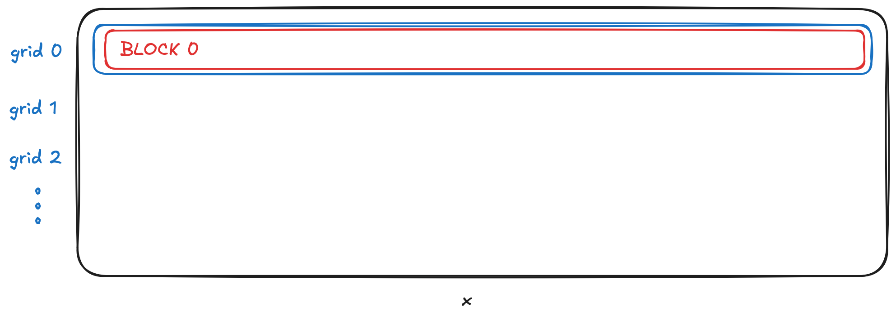

+++
title = "LLM.int8()"
slug = "llm-int8()"
date = 2025-06-13
+++

[LLM.int8(): 8-bit Matrix Multiplication for Transformers at Scale](https://arxiv.org/pdf/2208.07339)

# BitsAndBytes

Have you heard of [BitsAndBytes](https://github.com/bitsandbytes-foundation/bitsandbytes)?

It is a well-known quantization library for LLM Quantization of `fp16` to `int8`.

In this post, we are going to look at the core implementation of this library.

We are going to look at code that is implemented in Python with Triton.

## Row-wise Quantization

```python
# ommited

import triton
import triton.language as tl

# ommited

@triton.jit
def _quantize_rowwise(
    x_ptr,
    output_ptr,
    output_maxs,
    n_elements,
    BLOCK_SIZE: tl.constexpr,
    P2: tl.constexpr,
):
    pid = tl.program_id(axis=0)
    block_start = pid * BLOCK_SIZE
    arange = tl.arange(0, P2)
    offsets = block_start + arange
    row_mask = arange < BLOCK_SIZE
    x = tl.load(x_ptr + offsets, mask=row_mask)

    abs_x = tl.abs(x)
    max_val = tl.max(tl.where(row_mask, abs_x, 0), axis=0)
    output = tl.libdevice.llrint(127.0 * (x / max_val)) # llrint function only exists in cuda
    tl.store(output_ptr + offsets, output, mask=row_mask)
    tl.store(output_maxs + pid, max_val)

def quantize_rowwise(x: torch.Tensor):
    output = torch.empty(*x.shape, device=x.device, dtype=torch.int8)
    output_maxs = torch.empty(x.shape[0], device=x.device, dtype=torch.float16)

    P2 = int(2 ** (math.ceil(math.log2(x.shape[1]))))

    assert x.is_cuda and output.is_cuda
    n_elements = output.numel()
    grid = lambda meta: (x.shape[0],)
    _quantize_rowwise[grid](x, output, output_maxs, n_elements, BLOCK_SIZE=x.shape[1], P2=P2)
    return output, output_maxs
```

It calls `_quantize_rowwise` function per row of the input tensor `x`. i.e. $x \in \mathbb{R}^{n \times m}$, then `_quantize_rowwise` is called $n$ times.

In `_quantize_rowwise` function, it applies simple `fp16` to `int8` quantization. For more details, please checkout [quantization](@/AI-Accelerator/quantization/index.md)



### Why we set BLOCK_SIZE as `width of x`?

The reason why we don't make `BLOCK_SIZE` more smaller(making grid more compact) is because of synchronizing cost.

If we split a row into two blocks, then two threads that manages a single row should be synchronized(communicate the `element max` data). This cost is huge, which makes the performance worse.

### Why do we use P2 instead of just using the `width of x`?

The reason the code calculates `P2` is memory alignment issue. For most hardwares, memory operation performance increases if the memory size is aligned. Ex. RISC-V CPU performance increases if accessing memory address is aligned to 16.

So we use P2, and mask them out with `row_mask`.

## Summary

I went through the triton implementation of bitsandbytes quantization.
I believe looking at the implementation is the best way for understanding.
