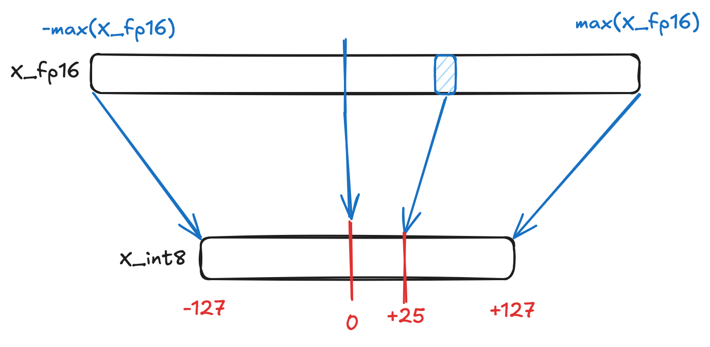

+++
title = "Quantization"
slug = "quantization"
date = 2025-06-13
+++

## Summary
Current bottleneck for AI hardware is memory bandwidth. Serving large models and maintaining its KV-cache use hundreds of GB of memory. Quantization is a technique that is used during model inference. Instead of using `fp16`, it uses `int8` or even more smaller bits. By doing so, we can use less memory(for storing model weights) and less bandwidth.

This post introduces fundamental quantization method.

## Quantization
Quantization in AI is about compacting the data using lesser bits. For example, most popular quantization method nowaday is converting `fp16` into `int8`. By doing so, we are just using half of bits during calculation.

However, we should be careful using quantization because quantization inevitably loses precision of the data. As we quantize fp16 into int8, and dequantize int8 into fp16, informations will be lost.

## Vector Quantization
Let's say we have following data:
$$X_{fp16} = \left[ 1.1, 4.5, 2.3, 5.6 \right]$$

Then we can quantize it by following method:

$max|X_{fp16}|$: max element of $|X_{fp16}|$

$\left\lceil x \right\rfloor$: nearest integer of $x$

$$ \begin{aligned}
X_{int8}
&= \left\lceil \frac{127 \times X_{fp16}}{max|X_{fp16}|} \right\rfloor \\\\
&= \left\lceil \frac{127}{max|X_{fp16}|} \times X_{fp16}\right\rfloor \\\\
&= \left\lceil s_{X_{fp16}} \times X_{fp16}\right\rfloor \\\\
&= \left\lceil 22.68 \times \left[ 1.1, 4.5, 2.3, 5.6 \right] \right\rfloor \\\\
&= \left[ 25, 102, 52, 127 \right]
\end{aligned}$$

## Vector Multiplication with quantization
Now let's look at how quantization is used in multiplication. I am going to look at vector multiplication, but you can easily apply it to matrix multiplication.

$$
X_{fp16} = \left[ 1.1, 4.5, 2.3, 5.6 \right] \\\\
Y_{fp16} = \left[ 8.7, -3.5, -3.3, 3.6 \right]
$$

Let's see how we can use quantization during cross-product: $X_{fp16}^T \cdot Y_{fp16}$

### Quantize
$$ \begin{aligned}
&X_{int8} = \left\lceil s_{X_{fp16}} \times X_{fp16}\right\rfloor
=\left[ 25, 102, 52, 127 \right] \\\\
&Y_{int8} = \left\lceil s_{Y_{fp16}} \times Y_{fp16}\right\rfloor
=\left[ 127, -51, -48, 53 \right] \\\\
\end{aligned}$$

### Cross-product with quantized vector
$$\begin{aligned}
C_{int32}
&=  X_{int8}^T \cdot Y_{int8} \\\\
&= \left[ 25, 102, 52, 127 \right]^T \cdot \left[ 127, -51, -48, 53 \right] \\\\
&=\begin{bmatrix}
3175 & -1275 & -1200 & 1325 \\\\
12954 & -5202 & -4896 & 5406 \\\\
6604 & -2652 & -2496 & 2756 \\\\
16129 & -6477 & -6096 & 6731 \\\\
\end{bmatrix}
\end{aligned}$$

### Dequantize

$$\begin{aligned}
&C_{fp16} = \frac {C_{int32}}{s_{X_{fp16}} \cdot s_{Y_{fp16}}} \\\\
&= \frac {C_{int32}}{331.06} \\\\
&=\begin{bmatrix}
9.59 & -3.85 & -3.62 & 4.00 \\\\
39.13 & -15.71 & -14.79 & 16.33 \\\\
19.95 & -8.01 & -7.54 & 8.32 \\\\
48.72 & -19.56 & -18.41 & 20.33 \\\\
\end{bmatrix}
\end{aligned}$$

## Quantization resolve memory pressure
You may wonder how quantization is related to `reducing memory usage`.

### Reducing weight matrix size
We can quantize the Weight matrix and Bias matrix. Since these matrixes(or tensors) are stored in HBM for MatMul, quantizing them will effectively shrink the GPU HBM Usage.
