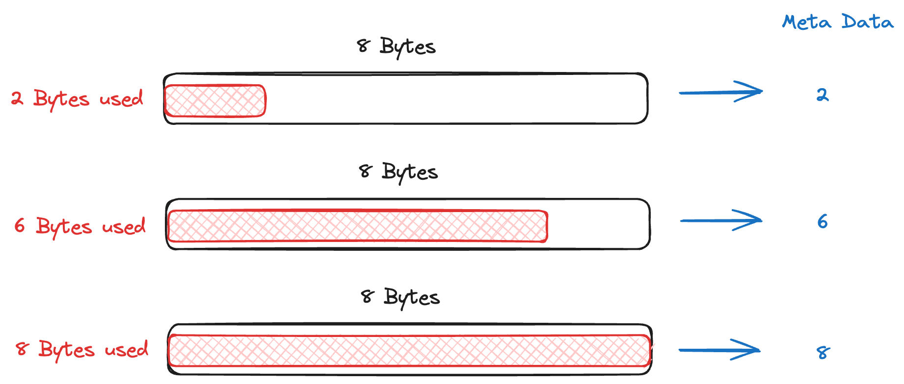

+++
title = "Address Sanitizer"
slug = "address-sanitizer"
+++

[AddressSanitizer: a fast address sanity checker](https://dl.acm.org/doi/10.5555/2342821.2342849)

## Summary
Address Sanitizer(ASAN) is a programming tool that can find memory bugs such as out-of-bound and use-after-free. Personally, I believe ASAN is in the `Top 10 tools that CS major students should learn`.

Please read the paper for more detailed information.

## Memory System Background
Before we talk about the core of ASAN, we are going to go through some backgrounds.

### 8 Bytes alignment
For every 64-bits System, every memory access(Read/Write) are aligned in 8 Bytes.
For example, to read 2 Bytes from the virtual address `0x10001`, program should read 8 Bytes from the virtual address `0x10000`.

> System is aligned in 8 Bytes because the CPU Register size is 64-bits= 8 Bytes. According to Von Neumann architecture, CPU should always bring the memory content to CPU cache for calculation.

### shadow memory
To debug memory leaks, every memory allocation/deallocation needs to store metadata.

For example, let's say program wrote 1204 Bytes at virtual address `0x10000`. After that, program tries to read 1208 Bytes at virtual address `0x10000`. This memory access is invalid because it is reading more than it wrote. If we can store metadata information indicating the length of memory content(1204 Bytes in the example), then we can detect invalid memory operations.
Metadata of every allocation/deallocation is called shadow memory.

## How Addresss Sanitizer works
**Number of addressable bytes are stored in shadow memory**

Address sanitizer stores `number of addressable bytes` in the shadow memory.

8 Bytes of memory chunk use 1 Bytes of shadow memory(metadata). The location of shadow memory in the memory is `(Virtual_Address >> 3) + Offset`. So we don't have to store the mapping of memory-chunk -> shadow memory location.

### Reference shadow memory for every memory operations
If calloc happens, then it writes the allocation information to shadow memory. And everytime Read/Write happens, then it reference the shadow memory and validate if it violates the addressable size.

### Out-of-bound error detection
If program calloc 3 Bytes, and tries to write 5 Byes:

During calloc, shadow memory value is set to 3. And before write operation, ASAN checks if the write_size is smaller or equal to shadow memory value. Since it's not, ASAN crash the program and notify out-of-bound happend in erroneous location .

### Use-after-free bug detection
If the program free the memory chunk, and tries to read 5 Bytes:

If we free the memory chunk, then the shadow memory value becomes 0. Before the read operation, ASAN checks if the read_size is smaller or equal to shadow memory value. Since it's not, ASAN crash the program and notify use-after-free happend in erroneous location.

## Downside of ASAN
ASAN is a powerful tool to find memory bug. But it a huge performance overhead because it has to check shadow memory for every memory operations(Read/Write) and memory allocation/deallocation. So we never use ASAN in production, but just in development stage.

## Conclusion
ASAN makes the memory fragile(easily crashable). Many CVEs are found using ASAN+Fuzzer. Make your program robust with ASAN!
