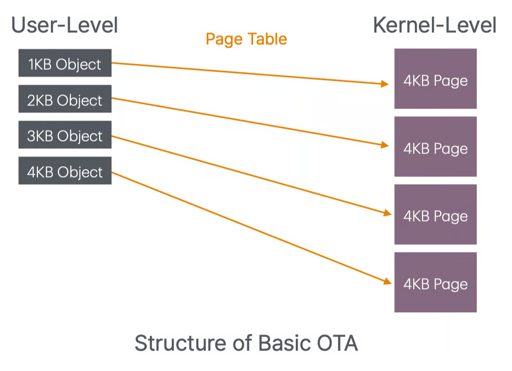
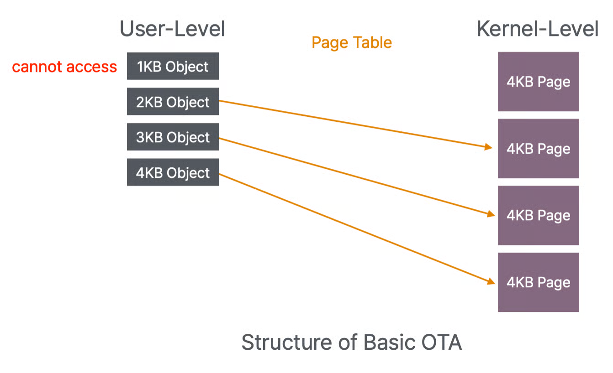
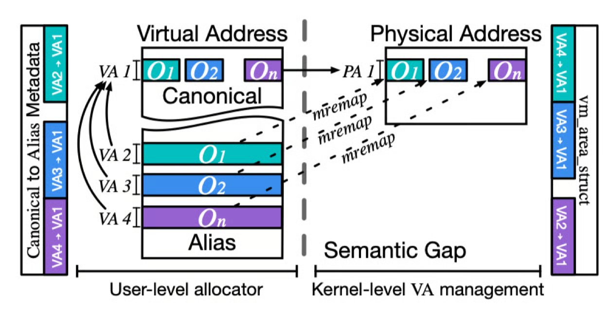
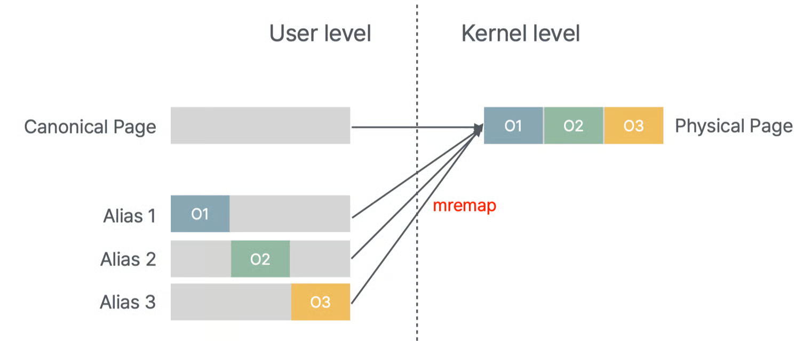
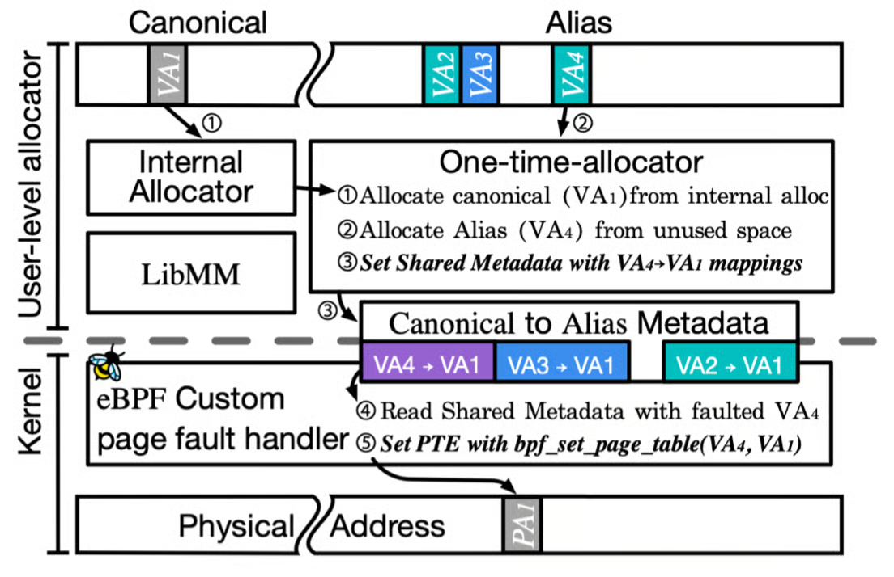
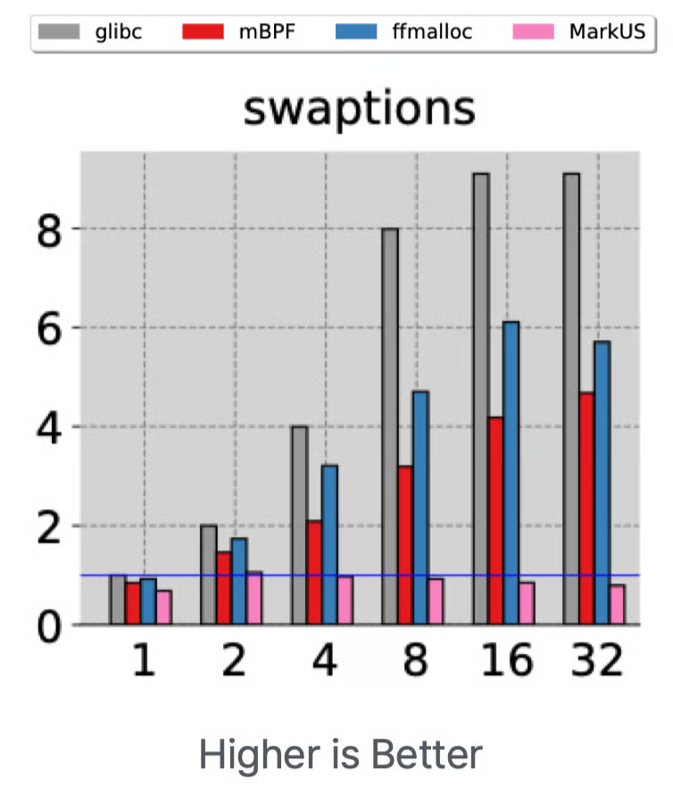
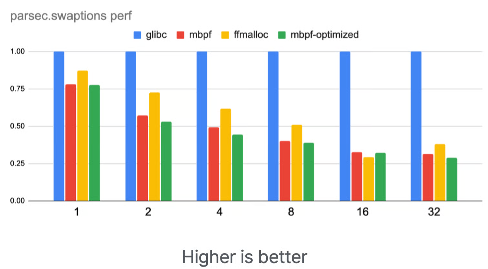
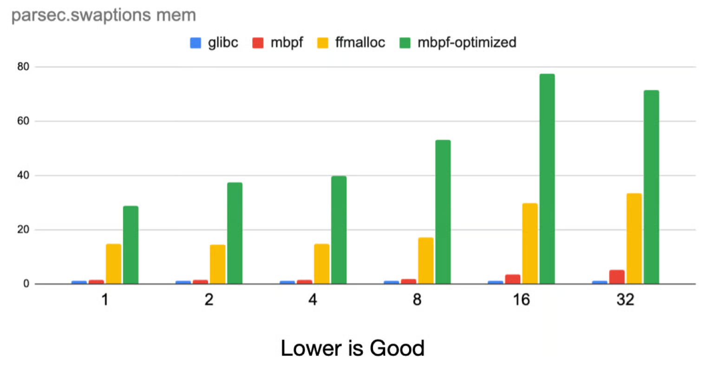

+++
title = "BUDAlloc"
slug = "budalloc"
+++

[BUDAlloc: Defeating Use-After-Free Bugs by Decoupling Virtual Address Management from Kernel](https://www.usenix.org/conference/usenixsecurity24/presentation/ahn)

## My Contributions
1. Built Benchmark script that shows the performance/memory overhead of BUDAlloc compared to other UAF protection systems such as FFMalloc, DangZero etc.
2. Built an automation script using gdb, which shows if the system(BUDAlloc, FFMalloc, DangZero etc) detected/prevented/vulnerable to various CVEs.
3. Proposed an optimization to the system, tested with several benchmarks if it is applicable.

## Summary
BUDAlloc use OTA(One-Time-Allocator) concept to prevent Use-After-Free bugs.

### OTA(One-Time-Allocator)
OTA is a concept of never reusing Memory chunk.

However, these basic OTA has two problems: Internal fragmentation and frequent syscalls

BUDAlloc effectively solved two problems as follows

## Solving Internal Fragmentation
BUDAlloc solved internal fragmentation using virtual aliasing. Virtual aliasing is a concept that makes another layer for virtual memory system. It makes the object allocated in seperate virtual page, but actually in same physical page.

## Solving Frequent Syscalls

BUDAlloc solved frequent syscall problem using eBPF. Frequent syscall for mremap, munmap was the main bottleneck for OTA.

The root cause of the syscall is the semantic gap between User-level and Kernel-level. Since Kernel-level doesn't have any information about the virtual alias, canonical pages, it requires syscall to get information about it.

However, BUDAlloc resolved semantic gap problem using eBPF.

## Optimization for PARSEC.swaptions benchmark

I observed a performance overhead at PARSEC.swaptions benchmark.

This was due to bottleneck in Canonical2Alias trie lookup. I tried to reduce entry numbers in the trie. So I partially adopted non-demand-paging to large pages(larger than 4KB). This idea was brought from FFMalloc. However, this caused a huge memory-overhead, and small performance improvement.

As a result, we didn't take this optimization.
