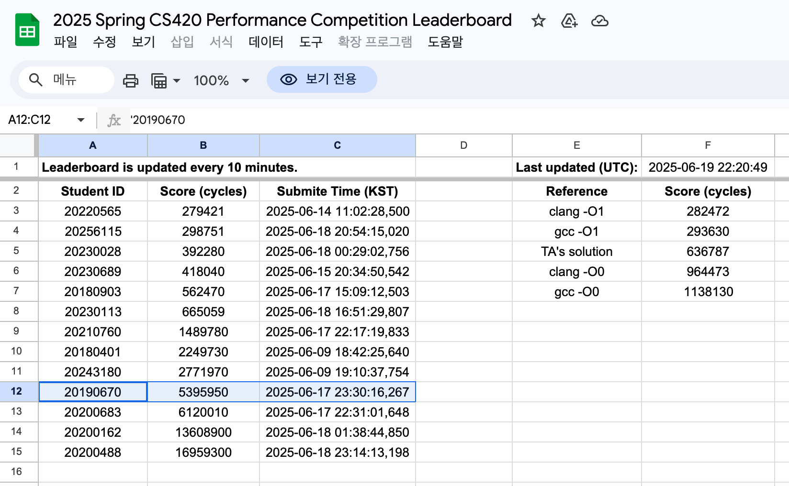

+++
title = "Building a RISC-V C Compiler"
slug = "building-a-risc-v-c-compiler"
date = 2025-06-21
+++

# Intro

During 2025 Spring Semester in KAIST, I have built a `RISC-V C Compiler` using Rust from scratch. It took me almost 200 Hours to build it.

Due to Honor Code of KAIST CS420, I cannot open up the code. But I would like to talk about key takeaways during building a compiler.

## I cannot live without Rust

Rust made me not caring about memory bug, and made design pattern uniform for my program.

Thanks to Rust, it only took 200 hours to build a C compiler! If this was C/C++, then it would have taken 1000+ hours.

If you want to learn system programming, then I strongly recommend you to learn `Rust`

## Test your code as much as possible

If you are running a large project, then testing is inevitable. If you don't have test, then finding a bug is finding a needle in a haystack.

This project was farely large(I wrote 10,000+ LOC), and testing helped me a lot. Also use fuzzer to generate random testcases.

If you are using C/C++ or unsafe Rust, then address sanitizer will help you find memory bug.

## Before hands-on, brainstorm your design at least 1 day

During my whole programming experience, I usually brainstormed the program design while implementation. However, this made me renew the whole design several times, which wasted a lot of time.

So during this project, I promised myself to think the design for at least 1 day. I still scraped the plan and started over several times, but it was much lesser than before.

## We should thank the compiler engineers

My compiler is still fragile, and will have bugs for many corner cases. My compiler cannot be used in production...

We(programmers) use compiler that is harshly optimized and severly tested. As you can see in the leaderboard image above, optimizing a compiler is super hard.

(I was 12th-place in performance contest due to lack of optimization...)

At the end of this project, I really thanked all the compiler engineers.

## Closing Remarks

I will try to make a live demo of my compiler. Since I cannot open up the code, I will try to build my program in wasm, and make it available in the browser.
