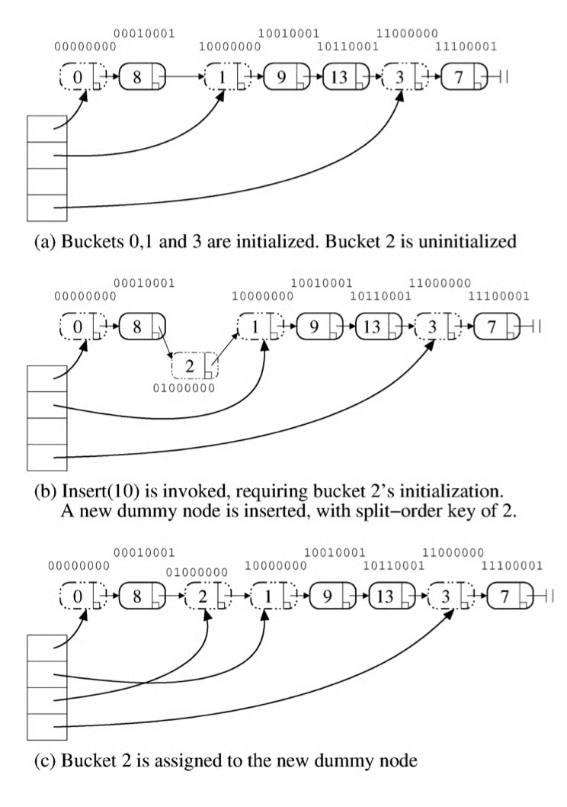

+++
title = "Lock-free HashTable"
slug = "lock-free-hash-table"
+++

[Split-ordered lists: Lock-free extensible hash tables](https://dl.acm.org/doi/10.1145/1147954.1147958)

As current programs try to fully utilize their CPU & GPU, concurrent programming is getting much more important. At this post, I want to talk about utilizing hash table in concurrent programming.

## Hash Table
Hashtable is the most popular data structure in programming. It is an efficient key-value store, which only takes $O(1)$ time for lookup.

However, hashtable cannot be used in concurrent programming. If multiple thread tries to R/W hash table, then data might get polluted. How can we overcome this problem?

## Using Global-lock
Yes, this can be the solution, but it will suffer performance bottleneck from getting the lock.

## Using Bucketwise-lock
If we give locks for each buckets, then performance bottleneck can be resolved. However, the problem happens when the bucket gets full, and we have to apply a new hash function and redistribute elements to the buckets. In this case, we would have to block every access to the hash table.

## How about lock-free?
If we cannot use a lock, then why not lock-free?

> The key point of implementing a lock-free datastructure is to make a single commit point using CAS(Compare-And-Swap). Please refer to other materials to understand about implementing a lock-free.

We use two structure to achieve lock-free hashtable: bucket-lookup table, and lock-free sorted linked list

### Bucket-lookup table
Bucket-lookup table points to the bucket starting node for given key. This can be easily made as lock-free.

### Lock-free sorted linked list
Elements and bucket nodes are sorted in a special way. Thanks to special ordering, it is very easy to split a bucket into half. (Which is the 'cause of problem' in bucketwise-lock implementation)

