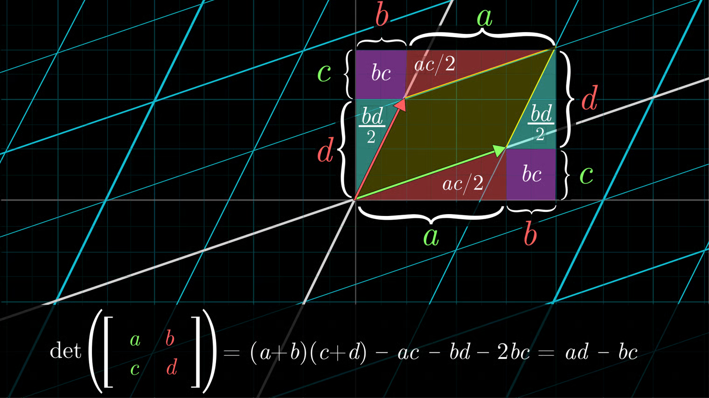

+++
title = "Determinant"
slug = "determinant"
+++

# Summary

Let's say we applied linear transformation into an area.

{{video(sources=["determinant-scaling.mp4"], w=500)}}

The definition of `Determinantis` how much the area expands after applying linear transformation.

## Calculating Determinant in 2D space

If we are applying linear transformation with following matrix:
$$L= \begin{bmatrix}
a & b \\\\
c & d \\\\
\end{bmatrix}$$

Then the determinant of  is derived as follows:

## Key Notes

If we have a following linear system where $A \in \mathbb{R}^{n \times n}, x \in \mathbb{R}^n$,
$$Ax=0$$

Then the determinant of $A$, also written as $det(A)$, is 0. This is because after linear transformation of input $x$, the area it takes should be 0.

## References

[1] [https://youtu.be/Ip3X9LOh2dk?si=FzrVo8imnNQTOxAX](https://youtu.be/Ip3X9LOh2dk?si=FzrVo8imnNQTOxAX)
[2] [https://www.3blue1brown.com/lessons/determinant#title](https://www.3blue1brown.com/lessons/determinant#title)
