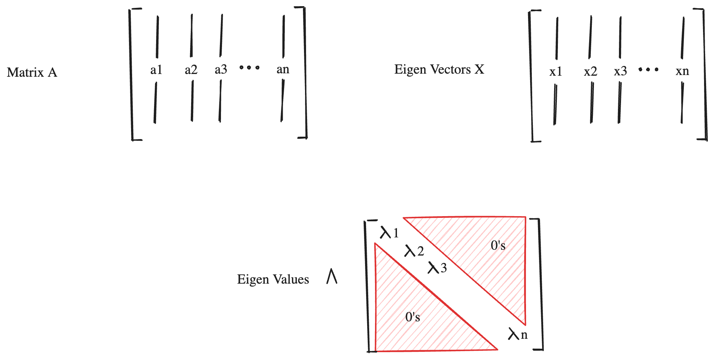

+++
title = "Eigen Value Decomposition(EVD)"
slug = "eigen-value-decomposition"
+++

## Eigen Values and Eigen Vectors
Let's say we have matrix $A \in \mathbb{R}^{n\times n}$.

The solutions $x \in \mathbb{R}^{n \times1}$ and $\lambda \in \mathbb{R}$ for the following equation are called eigen vectors and eigen values.

$$Ax=\lambda x$$

## Eigen-Value Decomposition

We are trying to decompose square-matrix $A \in \mathbb{R}^{n \times n}$.
Let's define a notation $\Lambda$ as diagonal matrix that diagonal elements are eigen-values.

Due to the definition of eigen-values and eigen-vectors, we can write the equation as following:

$$
A \mathbb{x}_1=\lambda\mathbb{x}_1 \\\\
A \mathbb{x}_2=\lambda\mathbb{x}_2 \\\\
A \mathbb{x}_3=\lambda\mathbb{x}_3 \\\\
...
$$

$$
A\begin{bmatrix}
 &  &  &  &  \\\\
| & | &| &  & | \\\\
\mathbb{x}_1 & \mathbb{x}_2 & \mathbb{x}_3 & ... & \mathbb{x}_N \\\\
 | &|  &|  &  & | \\\\
 &  &  &  &
\end{bmatrix} =
\begin{bmatrix}
 &  &  &  &  \\\\
| & | &| &  & | \\\\
\mathbb{x}_1 & \mathbb{x}_2 & \mathbb{x}_3 & ... & \mathbb{x}_N \\\\
 | &|  &|  &  & | \\\\
 &  &  &  &
\end{bmatrix}
\begin{bmatrix}
\lambda_1 & 0 & 0 & 0 &0  \\\\
0 & \lambda_2&0 & 0 & 0 \\\\
0 &0 & \lambda_3& 0 &0 \\\\
 0 & 0 & 0 & ... & 0 \\\\
0 & 0 & 0 & 0 & \lambda_N
\end{bmatrix}
$$

$$AX=X\Lambda$$

If we apply inverse of $X$ to each side, we get the following equation:
$$A=X \Lambda X^{-1}$$

## Special Case when A is symmetric square Matrix
There is a special case for EVD.
If Matrix $A$ is symmetric and square and have distinct eigen-values, then we can express EVD as follows:
$$A=X\Lambda X^T$$

### Proof of special case
We just have to prove that $X^{-1}=X^T$, which means $X$ is orthogonal matrix.
$$\lambda_1v_1 \cdot v_2 = A v_1 \cdot v_2 = A  v_2 \cdot v_1 = \lambda_2 v_2 \cdot v_1 = \lambda_2 v_1 \cdot v_2 \ ...(1)$$

From equation (1), we can derive following:
$$\lambda_1 v_1 \cdot v_2 - \lambda_2 v_1 \cdot v_2 = (\lambda_1 - \lambda_2) v_1 \cdot v_2 = 0$$

Since we assumed matrix $A$ have distinct eigen-values, we can derive $v_1 \cdot v_2=0$.

So we can say that $X^{-1}=X^T$

## References
[1] [https://angeloyeo.github.io/2020/11/19/eigen_decomposition.html](https://angeloyeo.github.io/2020/11/19/eigen_decomposition.html)
