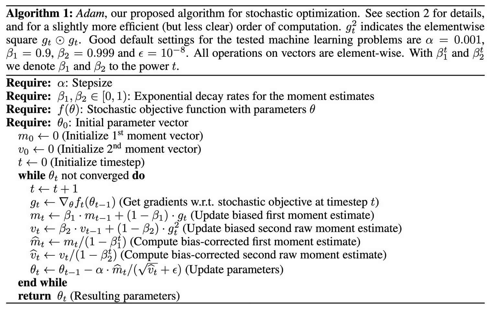
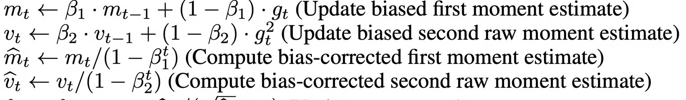

+++
title = "Adam Optimizer"
slug = "adam-optimizer"
+++

# Summary

In most training in Deep Learning, we use Adam Optimizer. In this post, I would like to discuss what is an optimizer, and reason we use Adam optimizer.

If you want more detailed information about Adam optimizer, please look at the following paper:

[Adam: A Method for Stochastic Optimization](https://arxiv.org/abs/1412.6980)

## What is an optimizer?

In Deep learning, we optimize the model to make lower loss. In other words, we call this procedure Training.

To optimize(minimizing the loss) the model, we use 'Gradient Descent method'. This is done by calculating each parameter's gradient and subtract it from the parameter value.

$$\theta_{t+1} = \theta_t - \lambda \frac {\partial L(X, \theta_t, \alpha_t, \beta_t, ...)}{\partial \theta_t}$$

## Why we need algorithm for optimizer?

Following GIF compares various algorithms in the local minima situation.

SGD cannot escape the local minima. Momentum algorithm escapes at final seconds. Other algorithms could easily escape the local minima.

As you can see, good algorithm can bring good training speed, and good model performance.

We are going to focus on Adam algorithm, but first things first! We are going to look at Momentum Algorithm and RMSProp Algorithm.

## Momentum Algorithm

Momentum algorithm is an algorithm that use previous moment value to calculate current moment.
$$\begin{aligned}
&m_t = \alpha \cdot m_{t-1} + (1-\alpha) \cdot g_t \\\\
&\theta_t = \theta_{t-1} - \lambda m_t
\end{aligned}$$

$m_t$: moment value at timestamp t
$\alpha$: moment weight constant
$g_t$: gradient calculated at timestamp t
$\theta_t$: model parameter at timestamp t
$\lambda$: learning rate constant

## RMSprop Algorithm

The key of RMSprop is following:
> If the gradient is big, the parameter convergence is reached early. On the other hand, if the gradient is small, then the parameter convergence is delayed.

So in RMSprop, it scales the learning rate by the size of gradient.

To calculate the size of gradient, it just square the gradient value!

$$\begin{aligned}
&r_t = \beta r_{t-1} + (1-\beta)(\triangledown_{\theta_t} L)^2 \\\\
&\theta_t = \theta_{t-1} - \frac {\alpha}{\sqrt{r_t} + \epsilon} \odot \triangledown_{\theta_t} L
\end{aligned}$$

## Adam

Adam algorithm is mixture of Momentum and RMSprop.

You can see there is a bias-correction step during the algorithm. Let's take a look at the reason

## Bias correction in Adam

Let's think $m_t, v_t, g_t$ as a probability distribution.
For example, $g_1, g_2, ..., g_t$ are sampled from distribution $G$.

$$for \ i=1...t,\\ \ m_i \sim  M, \ v_i \sim V, \ g_i\sim G$$

As the timestamp t increase, the estimate value of  converge.

$$E[m_t] \rightarrow E[g_t] \ and \  E[v_t] \rightarrow E[g_t^2]$$

However, there is a problem. When timestamp t is small, $E[m_t], E[v_t]$ is greatly biased.

$$\begin{aligned}
&m_t = (1-\beta_1) \cdot \sum_{k=1}^t \beta_1^{t-k}g_k \\\\
&E[m_t] = E[g_t] \cdot(1-\beta_1^t)
\end{aligned}$$

$$\begin{aligned}
&v_t = (1-\beta_2) \cdot \sum_{k=1}^t \beta_2^{t-k}g_k^2 \\\\
&E[v_t]=E[g_t^2] \cdot (1-\beta_2^t)
\end{aligned}$$

So in Adam divides $m_t, v_t$ by $1-\beta_1^t \ and \ 1-\beta_2^t$ to correct the bias.

## References

[1] [https://www.deepchecks.com/glossary/rmsprop](https://www.deepchecks.com/glossary/rmsprop)

[2] [https://optimization.cbe.cornell.edu/index.php?title=File:1_-_2dKCQHh_-_Long_Valley.gif](https://optimization.cbe.cornell.edu/index.php?title=File:1_-_2dKCQHh_-_Long_Valley.gif)

[3] [https://velog.io/@cha-suyeon/DL-%EC%B5%9C%EC%A0%81%ED%99%94-%EC%95%8C%EA%B3%A0%EB%A6%AC%EC%A6%98-RMSProp-Adam#adam](https://velog.io/@cha-suyeon/DL-%EC%B5%9C%EC%A0%81%ED%99%94-%EC%95%8C%EA%B3%A0%EB%A6%AC%EC%A6%98-RMSProp-Adam#adam)

[4] [https://arxiv.org/abs/1412.6980](https://arxiv.org/abs/1412.6980)
