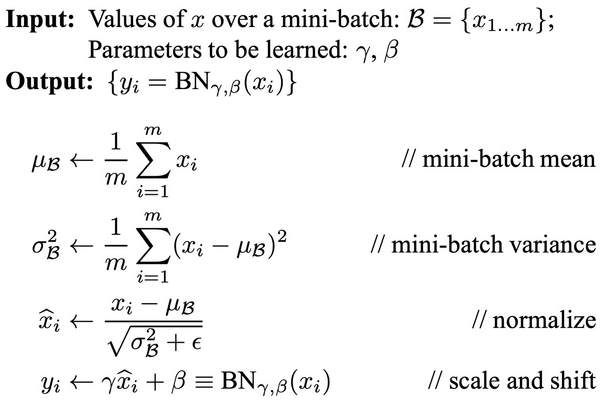

+++
title = "Batch Normalization"
slug = "batch-normalization"
+++

# Summary

Each layer's input affects all input of the preceding layers. If the input distribution fluctuates, then weights will adopt in different input distribution for each steps(Internal Covariate Shift). Batch normalization fix the input distribution for each layer.

[Batch Normalization: Accelerating Deep Network Training by Reducing Internal Covariate Shift](https://arxiv.org/abs/1502.03167)

## Problem with Deep Neural Network

### Internal Covariate Shift

If you see the neural network figure below, input of layer1 affects all the input in preceding layer. Also, weight change during training will cause the input distribution of preceding layers to change. Weights of each layer has to adopt in changing input distribution for each training steps.

This phenomenon is called `Internal Covariate Shift`.

In summary, following loop occurs during training.

1. Input distribution change in layer1
2. Input distribution change in all layers
3. Weights try to adopt to changed input distribution
4. As weight changes, input distribution changes
5. Go to 2

### Saturated Activation Problem

Sigmoid is a popular saturated activation function.
> Saturated Activation means that as  gets bigger, the gradient of the activation function converge to 0.

Let's think of a simple linear layer, and sigmoid activation function

$$\begin{aligned}
&x = Wu+b \\\\
&g(x) = \frac {1}{exp(-x)}
\end{aligned}$$

If we calculate the gradient of $x$,

$$\frac{\partial g(x)}{\partial W} = g'(Wu+b) \cdot u$$

As $|Wu+b|$ increase, the gradient $\frac{\partial g(x)}{\partial W}$ will converge to 0.
This is `Gradient Vanishing Problem`.
We can use non-saturating Activation such as ReLU(Rectified Linear Unit), but there might be a case sigmoid should be used.

## Batch Normalization

Batch Normalization reduce the internal covariate shift by fixing each layer's input distribution.

## References

[1] [https://arxiv.org/abs/1502.03167](https://arxiv.org/abs/1502.03167)

[2] [https://en.wikipedia.org/wiki/Sigmoid_function](https://en.wikipedia.org/wiki/Sigmoid_function)
