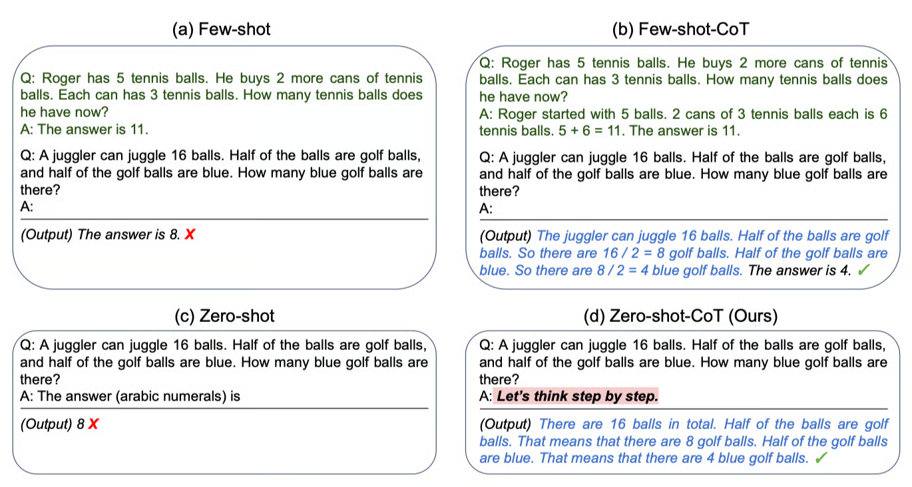

+++
title = "Chain of Thought"
slug = "chain-of-thought"
+++
[Chain-of-Thought Prompting Elicits Reasoning in Large Language Models](https://arxiv.org/abs/2201.11903)
[Large Language Models are Zero-Shot Reasoners](https://arxiv.org/abs/2205.11916)

# Summary

Due to scaling law of AI Model, LLMs are getting bigger and bigger. However, for reasoning tasks, performance improvement was poor.
Researchers came up with an idea of instead of changing the model checkpoints, they tried to make the model mimic human's thinking process using prompt engineering.
Chain-of-Thought technique is making a model use a reasoning-chain like human.

Instead of making model just output the answer, we can make the model output all the reasoning path approaching to the answer.
**Since LLMs(Transformer) are auto-regressive models, it reference the previous reasoning path to approach to the answer.**

## References

[1] [https://arxiv.org/abs/2201.11903](https://arxiv.org/abs/2201.11903)
[2] [https://arxiv.org/abs/2205.11916](https://arxiv.org/abs/2205.11916)
