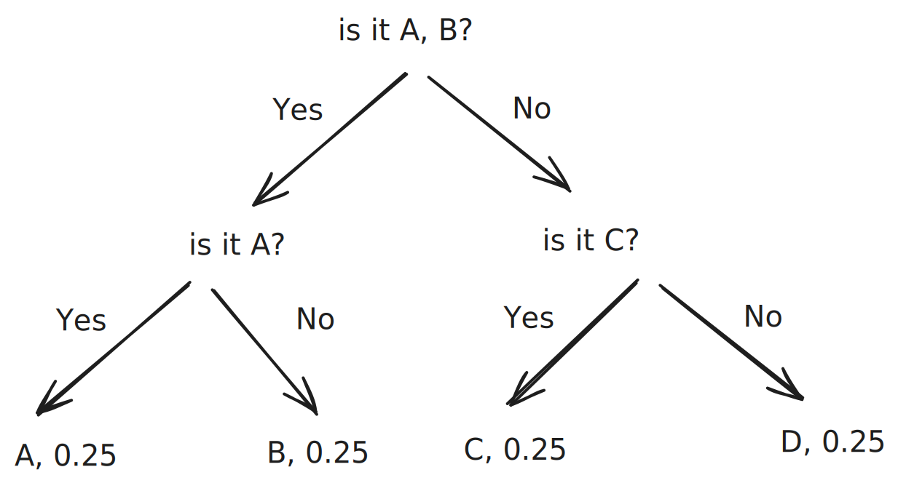
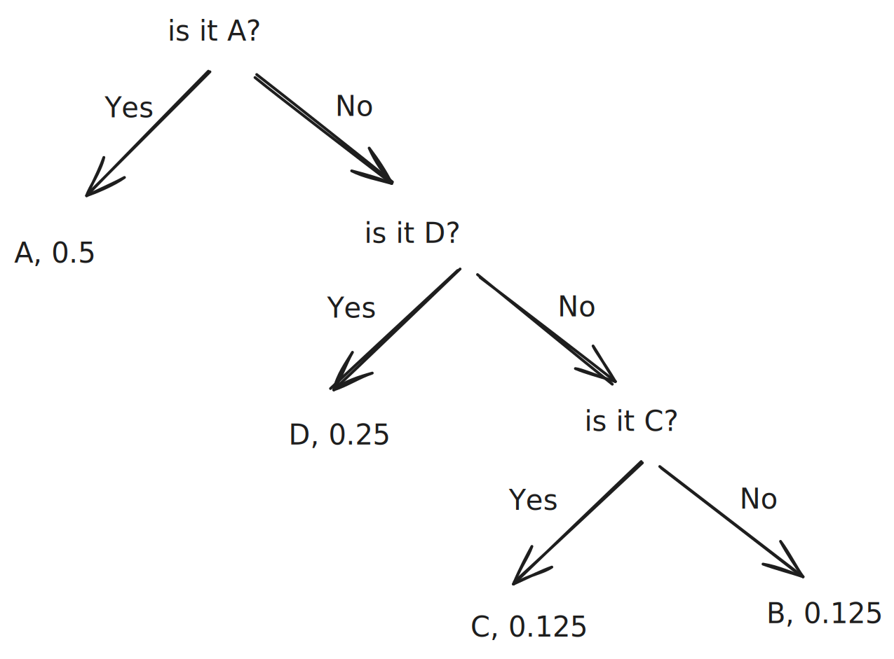

+++
title = "Cross Entropy"
slug = "cross-entropy"
+++

## Recall Entropy
Let's say there is a Machine P and Machine Q.

Machine P outputs character "A", "B", "C", "D" by probability of 0.25, 0.25, 0.25, 0.25.
Machine Q outputs character "A", "B", "C", "D" by probability of 0.5, 0.125, 0.125, 0.25.

As we went through this at [Entropy](@/Machine-Learning-Basic/entropy/index.md), each machine use different strategy to express characters as bits.

We use following strategy R for Machine P.

We use following strategy S for Machine Q.

## Cross Entropy
What if we apply Strategy S to Machine P? or Strategy R to Machine Q?

For two distribution P and Q, applying each other's strategy to be expressed as bits, required # of bits are cross-entropy.

### Strategy S applied to Machine P
We can calculate the cross-entropy as follows:
$$H(P, Q) = 0.25 \cdot log_2(0.5)+0.25 \cdot log_2(0.125)+ 0.25 \cdot log_2(0.125)+0.25 \cdot log_2(0.25)$$

### Strategy R applied to Machine Q
We can calculate the cross-entropy as follows:
$$H(Q, P) = 0.5 \cdot log_2(0.25)+0.125 \cdot log_2(0.25)+0.125 \cdot log_2(0.25)+0.25 \cdot log_2(0.25)$$

## Cross Entropy for P, Q
For two probability distribution P and Q, Cross-Entropy can be expressed as follows:
$$H(P, Q) = -\sum p \cdot log_2(q)$$

## Why cross-entropy is important in ML?
As two distribution P, Q gets similar, cross-entropy gets smaller. This is the key reason why ML use cross-entropy so often.

For ground-truth distribution P, and learnable distribution Q. We train Q(output of the learnable model) to be similar to distribution P. The training objective would be `Make the cross-entropy smaller!!`

## Refernces
[1] https://hyunw.kim/blog/2017/10/26/Cross_Entropy.html
