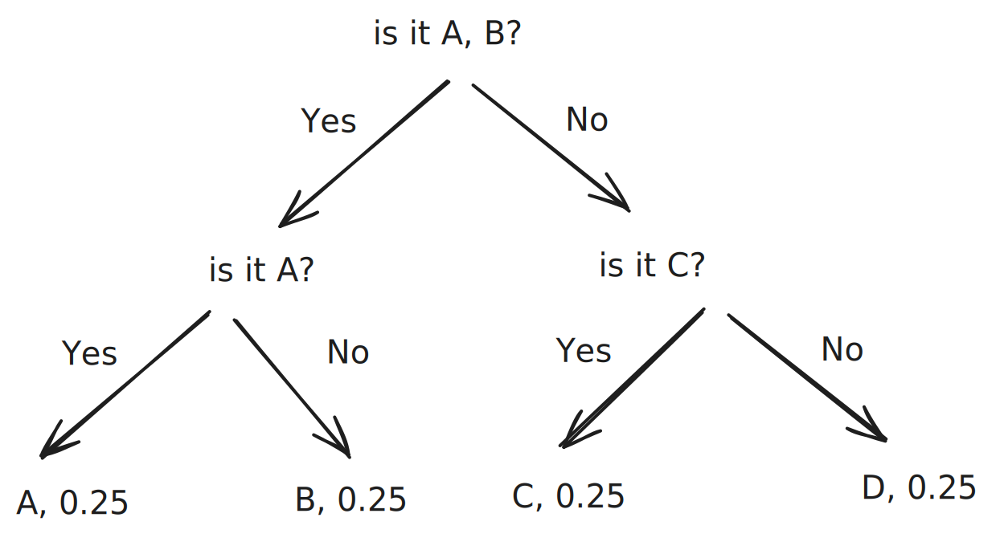
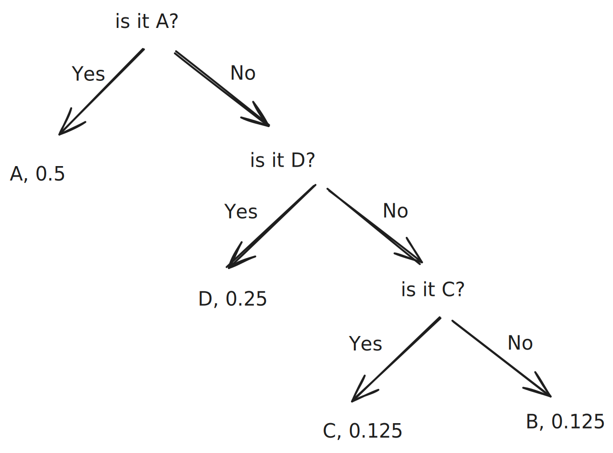
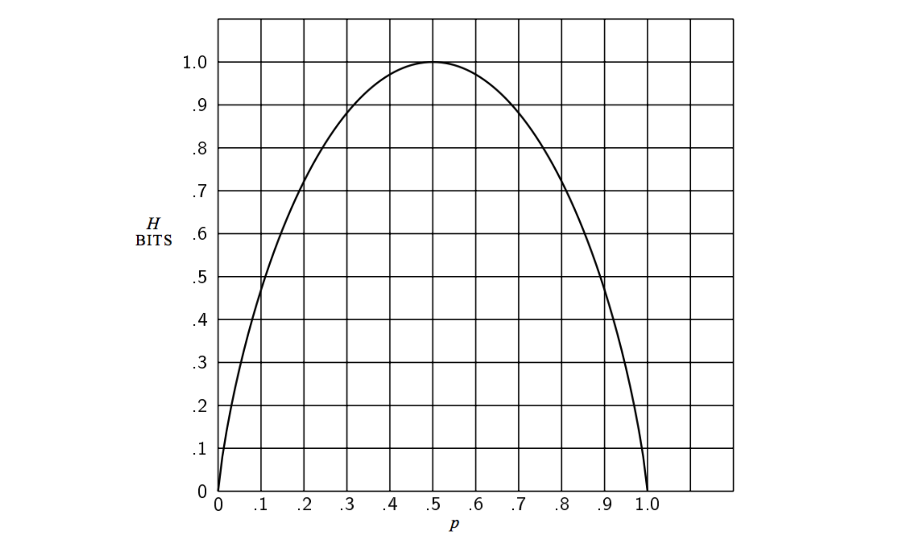

+++
title = "Entropy"
slug = "entropy"
+++

## Information theory

Let's say I want to send the result of 10 coin-flips with only 0 and 1(which is called bit). We can send it by sending 1 if Head appears, and 1 if Tail appears.

Another example is sending an number between 1\~100.

Some might answer that we have to send 100 bits. Sending an answer of following 100 questions: is it 1, is it 2, is it 3, ... is it 100.

Clever people would answer \\(log_2(100)\\). This could be achieved by sending answers of following questions: is it bigger than 50? is it bigger than 25/75? ...

## Definition of Entropy

Entropy is the quantity of the information. In other words, # of required bits to represent the information.

### Entropy with probability distribution

In the examples at [#information-theory](page-1.md#information-theory "mention"), I only mentioned about the case where possiblities of every cases are even. Coin can have Head or Tail by 50%, 50% probability.

How can we express if the Head / Tail probability is 30% / 70%?

Would it be \\(log_2(2)\\)? No. Since we know that Tail occur more often, simply representing it as `is it Tail?` isn't optimal to compact the informations into bits.

### Examples

Let's look at the example. Machine A, and Machine B

Machine A outputs character "A", "B", "C", "D" in equal probability, 0.25.

Amount of bits required can be calculated as $$0.25 \cdot 2 + 0.25 \cdot 2 + 0.25 \cdot 2 + 0.25 \cdot 2 = \sum 0.25 \cdot log_2(0.25)$$

Machine B outputs character "A", "B", "C", "D" in 0.5, 0.125, 0.125, 0.25 probability.

Since the probability is different, we can't do the same questions as machine A.

Instead, we can question as follows:

Amount of bits required can be calculated as $$0.5 \cdot 1 + 0.25 \cdot 2 + 0.125 \cdot 3 + 0.125 \cdot 3 = \sum p \cdot log_2(p)$$

#### Defining Entropy in Probability Distribution

In the probability distribtution, entropy can be expressed as follows:

$$
H = -\sum p \cdot log_2(p)
$$

If the probability distribution is even, then we need more bits(a.k.a # of questions) to express the data. However, if the probability distribution is not even, then lesser bits are required to express the data.

<figure>
    
    <figcaption>Entropy function for single coin flip. p is the probability of Head.</figcaption>
</figure>

## References

\[1] [https://hyunw.kim/blog/2017/10/14/Entropy.html](https://hyunw.kim/blog/2017/10/14/Entropy.html)

\[2] [https://www.youtube.com/watch?v=PtmzfpV6CDE](https://www.youtube.com/watch?v=PtmzfpV6CDE)

\[3] [https://www.youtube.com/watch?v=2s3aJfRr9gE](https://www.youtube.com/watch?v=2s3aJfRr9gE)
