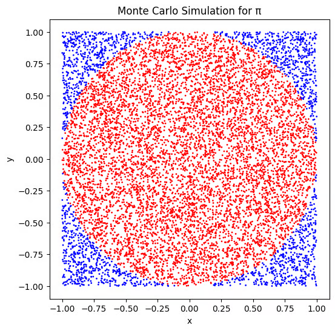

+++
title = "Monte-Carlo Method"
slug = "monte-carlo-method"
+++

# When do we use Monte-Carlo Method?

Let's say we don't know the parameters of Gaussian distribution P, but we can sample as much as we want.

Gaussian distribution has two parameters: mean $\mu$ and standard deviation $\sigma$

We can use Monte-Carlo Method at this situation!

## What is Monte-Carlo Method?

Monte-Carlo Method is a way to get information about the distribution using lots of sampling.

At the example above, we can sample 1,000,000,000 times to get the mean and std of the distribution P. There may be some errors, but as # of sampling gets bigger, error gets smaller.

## Estimate the value of  using Monte-Carlo Method

The circle with radius 1 has area of $\phi$.

We are going to do 1,000,000,000 sampling in the range of $x \in [-2, 2], y \in [-2, 2]$

We are going to say, the sample point is inside the circle if $x^2+y^2 \le1$

If N out of 1,000,000,000 points are inside the circle, then we can estimate the  as follows:

$$\pi = \frac{N}{1,000,000,000} \cdot 4\approx  3.14$$
