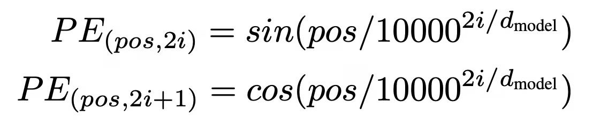

+++
title = "Rotary Position Embedding"
slug = "rotary-position-embedding"
+++

[RoFormer: Enhanced Transformer with Rotary Position Embedding](https://arxiv.org/abs/2104.09864)

## Why do we need Positional Encoding
In Transformer model, we apply self-attention method to calculate the relationship between other tokens.

But attention method doesn't account the location of the token.
For example, in the figure above, there are two token of "Jane" in a single sentence.
Based on human-knowledge, the first "Jane" is closely related to "went to the movie theater" part. And second "Jane" is related to "go back to her home".
But based on self-attention without positional encoding, "Jane" will equally attend to both meaning.

If we embed the positional information before attention method, then we can make the "Jane" attend to the left corpus. Since first "Jane" is close to the "went to the movie theater", it will attend to its meaning. Second "Jane" will attend to "go back to her home".

## How to Embed Positional Information
In the paper "Attention is All you Need", it uses Sinusoidal Positional Encoding. It adds sinusoidal value to the embedding vector to encode position information.
Please look at the paper to understand how it is used in the Transformer.

Now we can embed position information by slightly changing the embedding vector. Let's look at Rotary Positional Encoding(RoPE), an alternative of Sinusoidal Positional Encoding.

## Rotary Positional Encoding(RoPE)
Embedding vector is a vector in d_model dimension space. In RoPE, we don't add values to the vector, but we rotate the vector.

RoPE have many interesting feature. To deeply understand RoPE, we have to understand how we came up with this encoding scheme.

## RoPE in 2D case
To rotate a embedding vector, we apply matrix multiplication with `rotation matrix`.

$$\begin{bmatrix}
\cos{m\theta} & -\sin{m\theta} \\\\
\sin{m\theta} & \cos{m\theta} \\\\
\end{bmatrix}$$

For example, if we multiply this to arbitrary vector , then we get the rotated vector.
$$\begin{bmatrix}
\cos{m\theta} & -\sin{m\theta} \\\\
\sin{m\theta} & \cos{m\theta} \\\\
\end{bmatrix} \begin{bmatrix}
r\cos{\alpha} \\ r\sin{\alpha} \\\\
\end{bmatrix} = \begin{bmatrix}
r\cos({\alpha + \theta}) \\\\ r\sin({\alpha + \theta})
\end{bmatrix}$$

Amazing part is applying RoPE with dot-product attention method. $f_{q,k}(x_m,m)$ mean the query/key vector from embedding vector $x_m$ with RoPE.

$$f_{q,k}(x_m, m)=\begin{bmatrix}
\cos{m\theta} & -\sin{m\theta} \\\\
\sin{m\theta} & \cos{m\theta} \\\\
\end{bmatrix} \begin{bmatrix}
W_{q,k}^{(11)} & W_{q,k}^{(12)} \\\\
W_{q,k}^{(21)} & W_{q,k}^{(22)} \\\\
\end{bmatrix}\begin{bmatrix}
x_m^{(1)} \\\\ x_m^{(2)}
\end{bmatrix}$$

If we calculate the attention weight, we can get the following equation. This means that RoPE provides `Relative Position Embedding`.

$$\begin{aligned}
&q_m^Tk_n \\\\
&=f_q(x_m,m)^Tf_k(x_n,n) \\\\
&=\left ( \begin{bmatrix}
\cos{m\theta} & -\sin{m\theta} \\\\
\sin{m\theta} & \cos{m\theta} \\\\
\end{bmatrix} \begin{bmatrix}
W_{q}^{(11)} & W_{q}^{(12)} \\\\
W_{q}^{(21)} & W_{q}^{(22)} \\\\
\end{bmatrix}\begin{bmatrix}
x_m^{(1)} \\ x_m^{(2)}
\end{bmatrix} \right )^T \left( \begin{bmatrix}
\cos{n\theta} & -\sin{n\theta} \\\\
\sin{n\theta} & \cos{n\theta} \\\\
\end{bmatrix} \begin{bmatrix}
W_{k}^{(11)} & W_{k}^{(12)} \\\\
W_{k}^{(21)} & W_{k}^{(22)} \\\\
\end{bmatrix}\begin{bmatrix}
x_n^{(1)} \\ x_n^{(2)}
\end{bmatrix} \right ) \\\\
&= x_m^T W_q^T \begin{bmatrix}
\cos{(n-m)\theta} & -\sin{(n-m)\theta} \\\\
\sin{(n-m)\theta} & \cos{(n-m)\theta} \\\\
\end{bmatrix} W_k x_n
\end{aligned}$$

## RoPE in General Form
We can simply expand the 2D form of RoPE into multi-dim.

## RoPE with Linear Transformer
RoPE perfectly fits with Linear Transformer

In linear transformer, we can rewrite the attention method as follows:

shape of $Q, K$: (seq_len, d_model)

shape of $V$: (seq_len, d_model // n_head)

$Q_m$ means the $m$th row of matrix $Q$

$\phi(\cdot)$ is a row-wise kernel function

$$\begin{aligned}
&V_m' = \frac{\sum_{n}^{N}\phi(Q_m)^T\phi(K_n)V_n}{\sum_{n}^{N}\phi(Q_m)^T\phi(K_n)} \ ...(1) \\\\
&= \frac{\phi(Q_m)^T\sum_{n}^{N}\phi(K_n)V_n}{\phi(Q_m)^T\sum_{n}^{N}\phi(K_n)} \ ...(2)
\end{aligned}$$

In Linear Transformer, we reuse $\sum_{n}^{N}\phi(K_n)$, $\sum_{n}^{N}\phi(K_n)V_n$ term. When we reuse the terms, then it is hard to account every position relationship $(m, n=0), (m, n=1), (m, n=2), ...$ because we already calculate $\sum_{n}^{N}\phi(K_n)$ and $\sum_{n}^{N}\phi(K_n)V_n$.

So we use RoPE! Unlike sinusoidal embedding, we apply positional embedding after kernel calculation.

$$\begin{aligned}
&\phi(Q_m) \to R_{\theta,m}^d\phi(Q_m) \\\\
&\phi(K_n) \to R_{\theta,n}^d\phi(K_n)
\end{aligned}$$

Then we can rewrite equation (1) as following:

$$\begin{aligned}
&V_m' = \frac{\sum_{n}^{N} \left (R_{\theta,m}^d \phi(Q_m) \right )^T R_{\theta,n}^d\phi(K_n)V_n}{\sum_{n}^{N} \phi(Q_m)^T\phi(K_n)} \\\\
&= \frac{\phi(Q_m)^T \sum_{n}^{N}R_{\theta,n-m}\phi(K_n)V_n}{\phi(Q_m)^T \sum_{n}^{N}\phi(K_n)}
\end{aligned}$$

You might think that we cannot reuse $\sum_{n}^{N}\phi(K_n)V_n$ term no more. But this is not true. The norm of the term doesn't change, and it is just rotating as  change. So we can still reuse the term!

## References
[1] [https://arxiv.org/abs/2104.09864](https://arxiv.org/abs/2104.09864)
[2] [https://arxiv.org/pdf/2006.16236](https://arxiv.org/pdf/2006.16236)
[3] [https://blog.eleuther.ai/rotary-embeddings/](https://blog.eleuther.ai/rotary-embeddings/)
