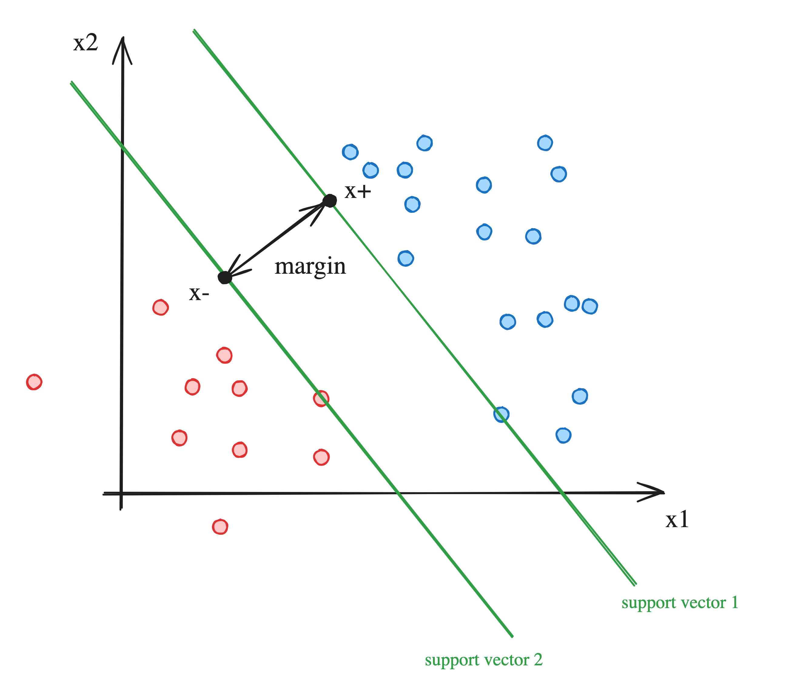
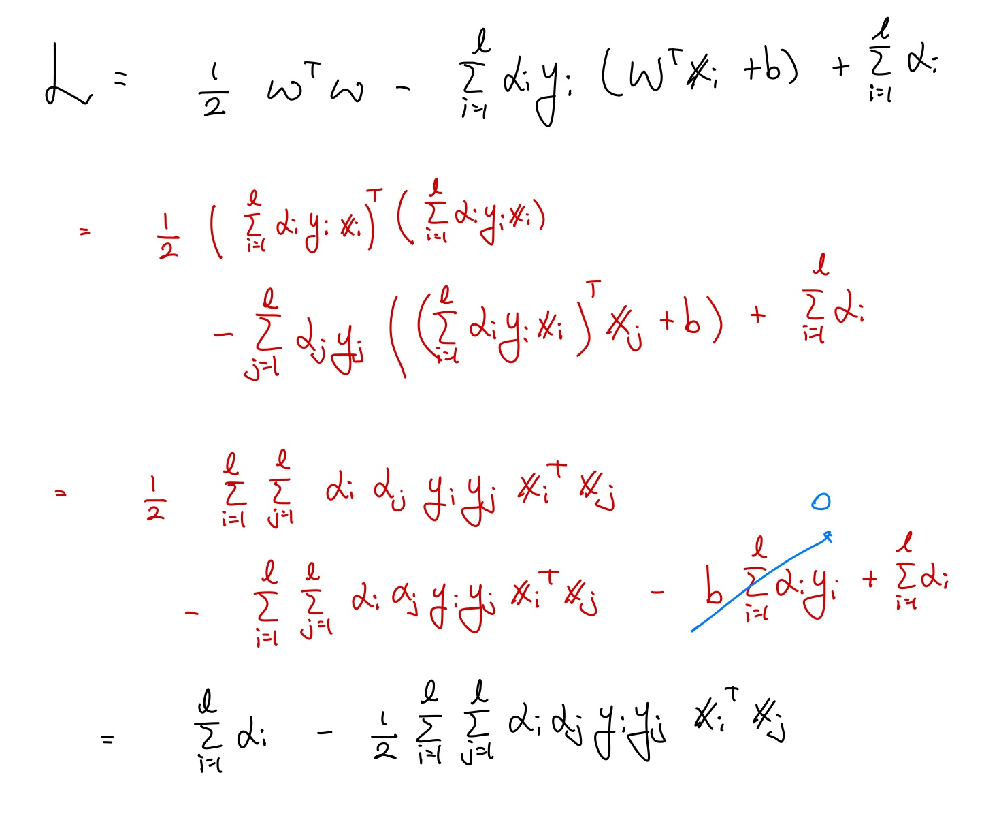
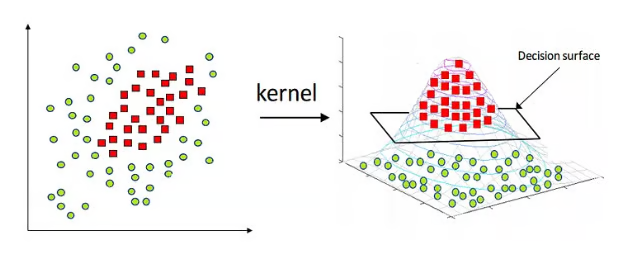

+++
title = "SVM"
slug = "svm"
+++

# What is SVM?

SVM(Support Vector Machine) is a linear classifier that maximizes the margin between two support vectors.

Support vectors are line that express the bound containing the data-point.

## Solving SVM

From SVM, we should get the weight $w$ and bias $b$ that maximize the margin.

Support vector 1: $w^Tx+b = +1 \ ...(1)$
Support vector 2: $w^Tx+b = -1 \ ...(2)$

Let's assume that right-side of support vector equation is always $+1$ or $-1$. (We can always scale $w, b$ to satisfy it!)

We define a point at each support vector: $x^+$ at support vector 1 and $x^-$ at support vector 2. Line $\overline{x^+x^-}$ is orthogonal to the support vector 1 and 2.

Subtracting equation (1) by equation (2) will result the following:

$$\begin{aligned}
&w^T(x^+-x^-) = 2 \ ...(3)  \\\\
&margin=||x^+-x^-||=\frac{2}{||w||} \ ...(4)
\end{aligned}$$

There is a important condition for SVM:
$$ \begin{aligned}
&\forall i \\\\
&if \ y_i=+1, then \ w^Tx_i+b\ge+1 \ ...(5) \\\\
&if \ y_i = -1, then \  w^Tx_i+b\le-1 \ ...(5)
\end{aligned} $$

If we simplify equation (5), then we can say
$$\begin{aligned}
&\forall{i}, \ y_i(w^Tx_i+b)\ge+1 \ ...(6)
\end{aligned}$$

### Objective of SVM

Our objective is to maximize the margin while satisfying the condition. We can express this objective as mathematical format.

$$\begin{aligned}
&Maximize \ \frac{2}{||w||} \ s.t.\\\\
&\forall{i},\  y_i(w^Tx_i+b) \ge +1
\end{aligned}$$

This objective is expressed as maximization target and inequality. If we use Lagrangian, we can express this as a single minimization target.
$$\begin{aligned}
&L = \frac{1}{2}w^Tw-\sum_{i=1}^l\alpha_iy_i(w^Tx_i+b)+\sum_{i=1}^l\alpha_i \ , \ where \ \forall{i}, \alpha_i \ge 0 \ ...(7) \\\\
&objective = \argmin_{w, b}L
\end{aligned}$$

Let's derive the $L$ with weight and bias:
$$\begin{aligned}
&\frac{\partial L}{\partial w} = w - \sum_{i=1}^l \alpha_iy_ix_i \\\\
&\frac{\partial L}{\partial b} = -\sum_{i=1}^l \alpha_i y_i
\end{aligned}$$

At the point where $L$ is minimum, both derivative will be zero.
$$\begin{aligned}
w^* = \sum_{i=1}^l \alpha_i y_i x_i \ ...(8) \\\\
&\sum_{i=1}^l \alpha_i y_i = 0 \ ...(9)
\end{aligned}$$

If we reconstruct the equation (7) using (8) and (9), we get

$$L = \sum_{i=1}^l \alpha_i - \frac{1}{2}\sum_{i=1}^l\sum_{j=1}^l \alpha_i \alpha_j y_i y_j x_i^Tx_j \ ...(10)$$

> Derivation of equation (10)
> 

Using equation (10), we can get all the $\alpha_i's$, and calculate the weights and bias.

## Can SVM only do Linear Classification?

Since support vector is linear, does SVM only supports linear classification?

No, SVM supports complex classification.

### Kernel

In upper example, we directly used $x$ in SVM calculation. How about using more complex vectors originated from $x$?
$$\begin{aligned}
&x = (x_0, x_1) \\\\
&\phi(x) = (x_0, x_1, x_0^2, x_1^2, x_0x_1)
\end{algned}$$

The kernel function $\phi(x)$ expanded the dimension of $x$ from 2 to 5. We can apply SVM to high-dimensional features!

### Overhead of Kernel Method

To solve the SVM, we should solve the following equation:
$$\begin{aligned}
&\phi: \mathbb{R}^n \to \mathbb{R}^d, d \gg n \\\\
&L = \sum_{i=1}^l \alpha_i - \frac{1}{2}\sum_{i=1}^l\sum_{j=1}^l \alpha_i \alpha_j y_i y_j \phi(x_i^T)\phi(x_j) \ ...(11) \\\\
&objective = argmin_{w, b} \ L
\end{aligned}$$

The computational cost of this equation is quadratic, which is $O(d^2)$
If $d = 100,000,000$, then the computational cost will explode. To resolve this, we use Kernel-trick.

### Kernel-Trick

Kernel-trick is defining $\phi(x)$ that is easy to compute $\phi(x) \phi(z)$.

$$K(x, z) = \phi(x)\phi(z)$$

So for most of the time, we use $\phi(x)$ that $K(x, z)$ is already known.

For example, polynomial kernel is defined as follows:
$$K_{polynomial}(x, z) = (x^Tz + c)^m, \ where \ c> 0$$

In most case, we don't need to know the exact function $\phi(x)$. We just need to know $K(x, z)$. We can ensure that there exists $\phi(x)$ because if certain condition is satisfied, we ensure that $\phi(x)$ exists for kernel $K(x, z)$.

### Mercer's Theorem

A symmetric function $K(x, z)$ can be expressed as an dot product

$$K(x, z) = <\phi(x), \phi(z)> for \ some \ \phi$$

if and only if $K(x, z)$ is positive semi-definite. i.e $\forall{datapoint \ pair \ (x_i, x_j)}, K(x_i, x_j) \ge 0$
