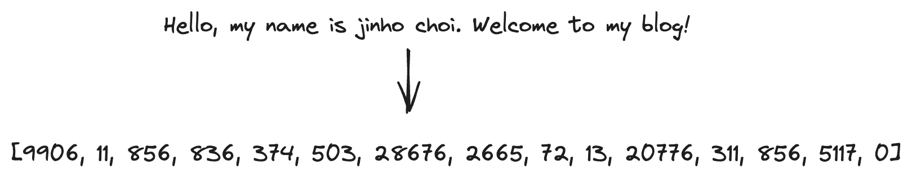
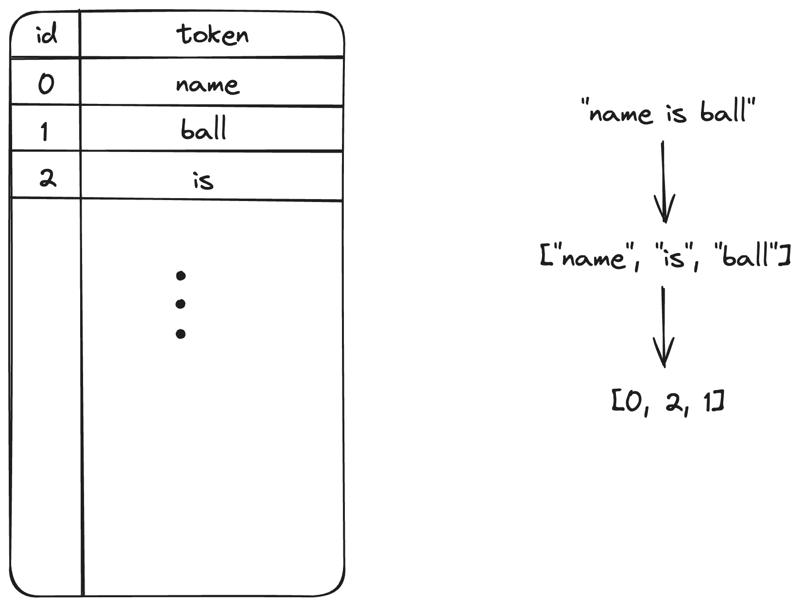

+++
title = "Tokenizer"
slug = "tokenizer"
+++

# Summary

In LLM(Large Language Model), model understands meaning of the corpus and generates an answer. Since deep learning models only understand vectors, we need a step to convert the words(or sentence) into a vector(and vice versa). This step is called `Tokenization`.

Following figure is tokenization result using GPT-4 Tokenizer.



The overall scheme of tokenization is as follows:

1. Define a vocab codebook
2. Segmentize the sentence into tokens
3. Convert tokens into token_ids using codebook.



We are going to look at some vocab codebook generation algorithm.

## Byte-Pair-Encoding(BPE)

BPE is a text compression algorithm that merges frequent character pair into single symbol.
For example, let's see the sentence "hug huggingface"

1. Divide sentence into characters. \
["h", "u", "g", "h", "u", "g", "g", "i", "n", "g", "f", "a", "c", "e"]

2. Check the frequency of character-pairs. \
("hu", 2), ("ug", 2), ("gg", 1), ...

3. Merge frequent pairs into a single symbol. If merging "i", "g", we are going to set the symbol as "ig". This is fine because we are eventually convert it to a integer. \
["hu", "g", "hu", "g", ...]

4. We iterate the merging step until we reach the desired vocab size. \
["hug", "hug", ...]

5. Give an integer id for each tokens. \
"hug" -> 1
"g" -> 2
...

## Wordpiece Encoding

Wordpiece encoding is similar to BPE, but have different merging algorithm. It merges character pair based on score.

$$score = \frac{P(pair)}{P(pair[0])P(pair[1])}$$

The probability $P(pair), P(pair[0]), P(pair[1])$ means the frequency of pair/character appearing in the sentence.

## Using a Tokenizer

In real-world NLP application, we use various pretrained tokenizer. The following code use gpt2 pretrained tokenizer(BPE) and tokenize the given prompt.

You can see that input_ids now have index number of each tokens.

```python
from transformers import AutoTokenizer

tokenizer = AutoTokenizer.from_pretrained("gpt2")
prompt = "Hello, this is an example playing with gpt2 tokenizer. My name is ball!"

input_ids = tokenizer(prompt, return_tensors="pt").input_ids
print(input_ids)

# output is
# tensor([[15496,    11,   428,   318,   281,  1672,  2712,   351,   308,   457,
#            17, 11241,  7509,    13,  2011,  1438,   318,  2613,     0]])
```

## References

[1] [https://databoom.tistory.com/entry/NLP-%ED%86%A0%ED%81%AC%EB%82%98%EC%9D%B4%EC%A0%80-Tokenizer](https://databoom.tistory.com/entry/NLP-%ED%86%A0%ED%81%AC%EB%82%98%EC%9D%B4%EC%A0%80-Tokenizer)

[2] [https://huggingface.co/learn/nlp-course/en/chapter6/5](https://huggingface.co/learn/nlp-course/en/chapter6/5)

[3] [https://huggingface.co/learn/nlp-course/en/chapter6/6?fw=pt](https://huggingface.co/learn/nlp-course/en/chapter6/6?fw=pt)
