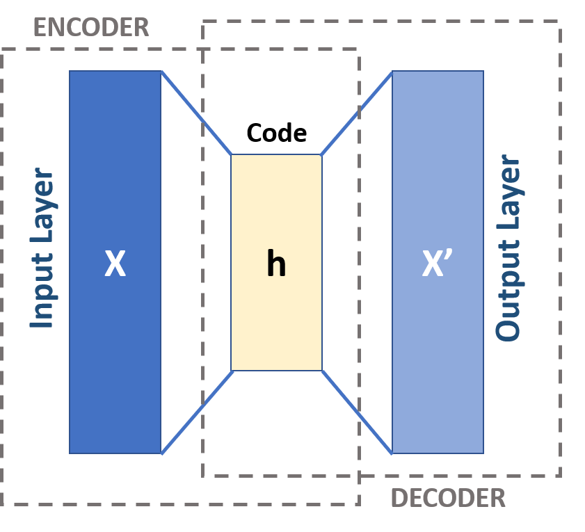
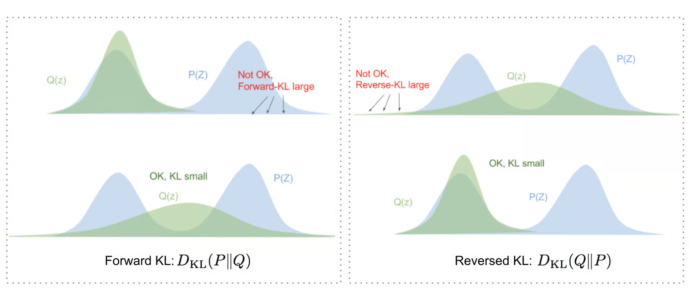
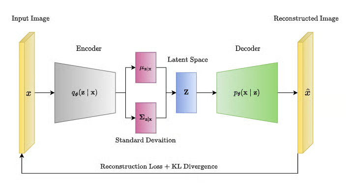
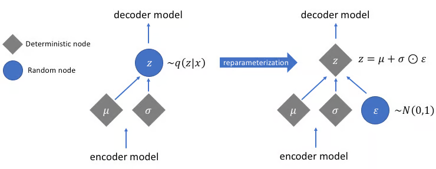

+++
title = "Variational Auto-Encoder"
slug = "variational-auto-encoder"
+++

# What is an Encoder, Decoder?

Before Machine Learning algorithms process data, all non-matrix datas are converted to low-dimensional vector(called `Latent vector`). For example, for text, they are converted to embedding spaces.

This is crutial step because if we just use one-hot vector, then the vector dimension would be very large, and this will make the computational cost explode.

Encoder is an algorithm that converts real-data(Text, Image) into low-dimension matrix.

Decoder is an algorithm that converts low-dimension matrix into real-data.

In deep learning, we often use neural network such as CNN for encoder/decoder.

## Limitation of previous Auto Encoder

Auto encoder outputs latent vector, called $z$, for input $x$.
Decoder will be trained to convert $z$ into $x$ again.

However, auto encoder outputs same latent vector if the input is same. which means that, decoder won't be able to produce various generative outputs for same input. Also, decoder won't be trained to produce valid outputs if the latent vector slightly change.

This limitation brings the use of VAE.

## Variational Auto-Encoder

Variational Auto Encoder(VAE) produce a distribution of latent vector for input.

> The term `distribution of latent vector` is hard to understand. Let's say latent vector is 3-dimensional. Latent vector can be expressed as $z = (p, q, r)$. Distribution of latent vector means that, each of $p, q, r$ are distribution and not deterministic values.
>
> $p \sim N(0, 1)$, $q \sim N(1, 2)$, $r \sim N(-1, 1)$

However, neural networks(CNN, RNN) used in encoder don't have an ability to produce a distribution for same input. Instead, we structure the encoder to produce the mean $\mu$ and variant $\sigma$. And we set the latent vector as Gaussian distribution $z \sim N(\mu, \sigma)$

## How VAE Works?

Let's think of specific case of VAE.

### Defining a problem

We want to build a VAE as follows:

input $X$: picture taken by a camera

output $Z$: the angle of the camera, focus of the lense, type of figure that is taken

Important fact is that we can observe $X$, but not $Z$.
We want to know the distribution of $Z$ when $X$ is given(= $p(Z|X)$)

### Applying Bayes Theorem

Due to Bayes theorem, we can come up with following equation.

$$p(Z|X) = \frac{p(X|Z) \cdot p(Z)}{p(X)}$$

Can we just calculate it? No, we cannot.

### Tractable terms and Intractable term

The term $p(Z)$ is the distribution of latent vector. Also called as prior distribution for latent vector. This is tractable because we usually approximate $Z$ into tractable distribution such as Gaussian.

The term $p(X|Z)$ is the distribution of decoder output when latent vector $Z$ is given. This is tractable because this is a simple calculation of decoder neural network.

The term $p(X)$, is however intractable. As the decoder neural network gets complicated(which makes complex $p(X|Z)$), it is impossible to do integral for all latent space.

$$p(X) = \int p(X|Z) \cdot p(Z) dZ$$

So Bayes Theorem is not enough!

### New way to calculate $p(Z|X)$?

Approximating $p(Z|X) \approx q(Z|X)$ is the method used in VAE. $q$ is well-known distribution such as Gaussian.

We are going to use KL-divergence to find best matching $q(Z|X)$ close to $p(Z|X)$.

### Approximating that minimize KL-Divergence

Finding best-fitting $q(Z|X)$ is as follows:

$$q^*(Z|X) = \underset{q(Z|X)}{argmin}  \ KL(q(Z|X), p(Z|X))$$

Let's unwrap the KL-divergence to take a deeper look.

$$ \begin{aligned}
&KL(q(Z|X), p(Z|X)) \\\\
&= \int_{latent \ space} q(Z|X) \cdot log(\frac{q(Z|X)}{p(Z|X)}) \ dZ \\\\
&= \int_{latent \ space} q(Z|X) \cdot log(\frac{q(Z|X) \cdot p(X)}{p(X, Z)}) dZ \\\\
&= \int_{latent \ space} q(Z|X) \cdot log(\frac{q(Z|X)}{p(X, Z)})dZ + \int_{latent \ space} q(Z|X) \cdot log(p(X)) dZ \\\\
&= E_{Z \sim q(Z|X)}[log(\frac{q(Z|X)}{p(X,Z)})] + E_{Z \sim q(Z|X)}[log(p(X))] \ ...(1) \\\\
&= -L(q) + log(p(X)) \ ...(2) \\\\
&= -L(q) + evidence \end{aligned}$$

The left term in (1) can be expressed as $-L(q)$ because $p(X, Z)$ is known.($p(X|Z), p(Z)$ are tractable!)

The right term in (1) does not depend on . As a result, it can be represented as right term in (2). This is also referred as `evidence`.

### Analyzing more deeper

Since probability is between 0~1, evidence is always smaller or equal to 0.

Also, KL-divergence is always bigger or equal to 0.

This results $L(q) \le evidence$, which means that $L(q)$ is the evidence lower bound, a.k.a ELBO.

$$ \begin{aligned}
&KLD = -ELBO + evidence \\\\
&ELBO = L(q) = E_{Z \sim q(Z|X)}[log(\frac{p(X,Z)}{q(Z|X)})]
\end{aligned}$$

### Applying it to Variational Inference

$$ \begin{aligned}
&q^*(Z|X) \\\\
&= \underset{q(Z|X)}{argmin}  \ KL(q(Z|X), p(Z|X)) \\\\
&= \underset{q(Z|X)}{argmax} \ L(q)
\end{aligned} $$

If we find the optimal $q^*(Z|X)$, then this means that we can encode the input $X$ into latent distribution $q^*(Z|X)$, which is an approximation of $p(Z|X)$.

The encoder learns to output mean and standard deviation of the input image. For outputs of encoder $\mu$ and $\sigma$, it makes latent space based on Gaussian distribution with parameter $\mu$ and $\sigma$.

## Critical problem in VAE

There is a critical problem in VAE:
To get latent vector, we sample from the distribution $q^*(Z|X)$. However, sampling from distribution is not differentiable, because it is just picking a random sample from the distribution.

### Reparameterization Trick

Reparameterization is a method that express the randomness using one more parameter.

Using reparameterization, we can move the random sampling step to unimportant node $\epsilon$.

## Implementation details

You can train and run VAE model to generate various MNIST picture in

[https://github.com/jinho-choi123/VAE-pytorch/tree/main](https://github.com/jinho-choi123/VAE-pytorch/tree/main)
