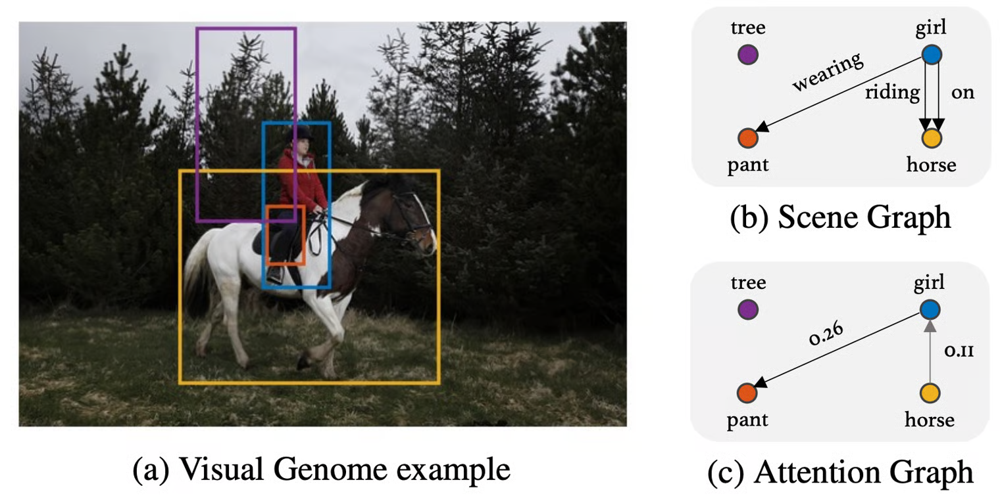
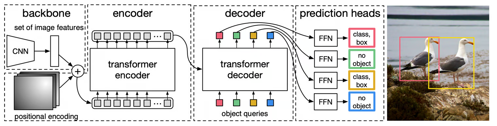
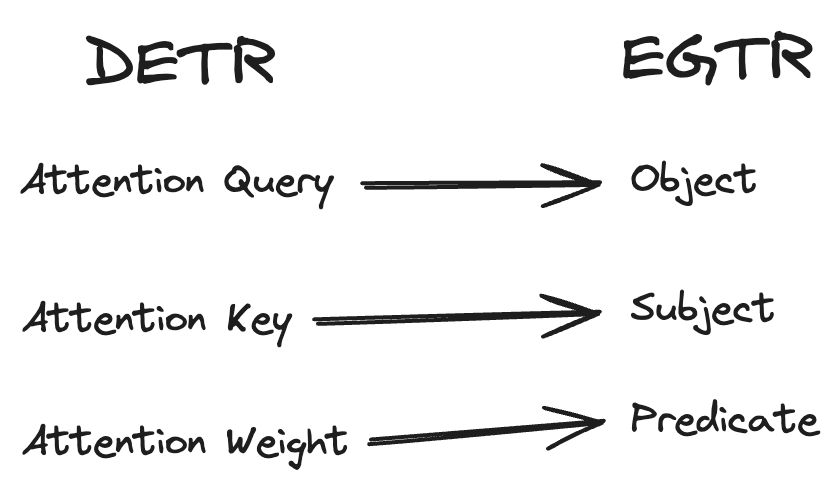
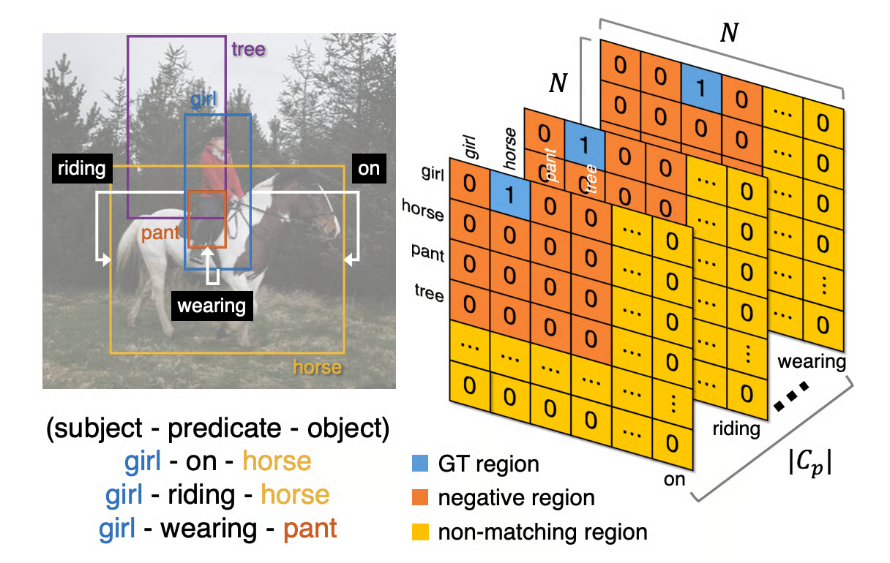

+++
title = "EGTR: Scene Graph Generation Model"
slug = "egtr"
+++
[EGTR: Extracting Graph from Transformer for Scene Graph Generation](https://arxiv.org/abs/2404.02072)

## Scene Graph Generation(SGG)
Scene Graph is a graph structure that acts as a knowledge graph of the given scene. For example, in the figure below, we can see that girl is riding a horse. We can represent this as triplet (girl, riding, horse). If we gather all the triplets of the scene, we can construct a scene graph.

## Scene Graph Generation should be coupled with Object-Detection
To draw a scene-graph, we should definitely detect objects in the scene. This is why SGG is coupled with object-detection. (There are some attempts to decouple this!)

EGTR use DETR as object-detection baseline. Interestingly, EGTR use all the intermediate query/key of all layers in DETR to generate a scene graph. Let's take a closer look!

## Background: DETR
Let's take a look at DETR.

DETR use Transformer.
1. It first use CNN to extract features.
2. It use Transformer Encoder and apply self-attention to generate image embeddings.
3. The Transformer Decoder use image embeddings and object queries to generate $N$ object embedding.
4. These object embeddings go through FFN and outputs list of (class, bounding box).

> You may wonder about object queries. Object queries can be thought as questions of the image. For example, object queries are embeddings representing questions such as "Does it have a feather?" or "Is there a tree?"
> Object queries are also a learnable parameters.

## EGTR and DETR
Many previous study did separate attention computation to calculate the relationship between objects.

In EGTR, it fully utilize the intermediate query/key of DETR computation.

It actually does't use attention weight of DETR. Instead, it concatenate Attention Query and Attention Key to use it as a predicate in EGTR. Please read the paper for more information.

## Adaptive Smoothing
In the initial phase of training, DETR is not well-trained. Then training the SGG part of EGTR can not be stable. So at the beginning, we measure the uncertainty of object-detection result and account it during training.

## Sparse graph sampling

If the $N$ (maximum number of detectable objects) gets bigger, the size of Scene-Graph gets bigger.
(Size of Scene Graph is $O(N^2 \times |C_p|)$)
But most of the entries will be zero. So we apply sampling for likely-to-be-zero regions(negative region and non-matching region).
This significantly reduce the computation cost.

## References
[1] [https://arxiv.org/pdf/2404.02072](https://arxiv.org/pdf/2404.02072)
[2] [https://arxiv.org/pdf/2005.12872](https://arxiv.org/pdf/2005.12872)
[3] [https://herbwood.tistory.com/26](https://herbwood.tistory.com/26)
[4] [https://taek-guen.tistory.com/78](https://taek-guen.tistory.com/78)
[5] [https://www.digitalocean.com/community/tutorials/introduction-detr-hungarian-algorithm-2](https://www.digitalocean.com/community/tutorials/introduction-detr-hungarian-algorithm-2)
