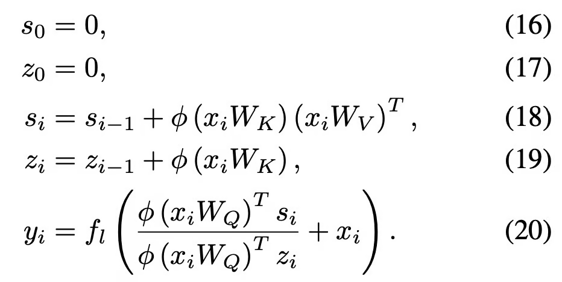

+++
title = "Linear Transformer"
slug = "linear-transformer"
+++

[Transformers are RNNs: Fast Autoregressive Transformers with Linear Attention](https://arxiv.org/abs/2006.16236)

# Summary

I got impressed by this fantastic paper. It uses feature mapping in self-attention, and optimize the computation cost to `linear`.

## Problem with Transformer Model

The transformer model has high computation and memory cost.
Since it has to calculate the similarity for every embedding pair in query and keys, computation cost is $O(N^2 \cdot ?)$. Transformer has to store all the computation results because of softmax computation, which brings memory cost to $O(N^2 \cdot ?)$. ($N$ is sequence length)
As sequence length grow, the computation and memory cost increase dramatically.

As sequence length grow, the computation and memory cost increase dramatically.
$$Q \in  \mathbb{R}^{N\times D}, K \in  \mathbb{R}^{N\times D}, V \in  \mathbb{R}^{N\times M}$$

Notation $V_i, Q_i, K_i$ means the $i$th row in $V, Q, K$.

We can rewrite the self-attention calculation as follows:
$$V_i' = \frac{\sum_{j}^{N}sim(Q_i, K_j) \cdot V_j}{\sum_{j}^{N}sim(Q_i, K_j)} ...(1)$$

The computation cost would be $O(N^2 \cdot max(D, M))$

## How $O(N^2 \cdot max(D, M))$ came out?

You may be curious how $O(N^2 \cdot max(D, M))$ came up.

In denominator, it takes $O(D)$ to multiply $sim(\cdot)$. We are caching $sim(\cdot)$ result, and use it during calculating numerator.

In numerator, it takes $O(M)$ to multiply $sim(\cdot) \cdot V_j$ part. (We are reusing calculation in denominator.

Since calculating denominator and numerator can be done in parallel, overal computation cost $O(N^2 \cdot max(D, M))$

## Using feature-mapping(kernel function)

Linear Transformer is closely related to kernel-trick in SVM.

$$sim(Q_i, K_j) = \phi(Q_i) \cdot \phi(K_j)$$

If we assume $sim(x, y)$ is non-negative, we can seperate it into two feature mapping.(Mercer's Theorem)

Then we can rewrite the equation (1) as follows:
$$\begin{aligned}
&V_i'=\frac{\sum_j^N \phi(Q_i)^T\phi(K_j)V_j}{\sum_j^N\phi(Q_i)^T\phi(K_j)} \\\\
&= \frac{\phi(Q_i)^T\sum_j^N\phi(K_j)V_j}{\phi(Q_i)^T\sum_j^N\phi(K_j)} ... (2)
\end{aligned}$$

The term $\sum_j^N\phi(K_j)V_j$ and $\sum_j^N\phi(K_j)$ can be reused. $C$ is the dimension of $\phi(\cdot)$.
Then the computation cost for self-attention is $O(NCM)$

## How $O(NCM)$ came out?

$\sum_j^N\phi(K_j)V_j$ would take $O(NCM)$ calculation. This term is cached, which means not affecting the overall computation cost.

Calculating the numerator takes $O(CM)$ calculation cost.

Calculating the denominator takes $O(C)$.

Eventually, the calculation cost is $O(NCM)$ because getting $V$ means getting every $V_i', i=0...N-1$.

## Transformer is RNN in Causal Masking

The paper suggest an interesting perspective: viewing Transformer as an RNN

Transformer can be used as autoregressive model by masking the attention computation such that $i$th position can only influence $j$th position s.t. $j \le i$.

Then the self-attention calculation can be written as follows:

$$\begin{aligned}
&V_i'=\frac{\sum_j^isim(Q_i, K_j)V_j}{\sum_j^isim(Q_i, K_j)} \\\\
&= \frac{\phi(Q_i)^T\sum_j^i\phi(K_j)V_j}{\phi(Q_i)^T\sum_j^i\phi(K_j)} ...(3)
\end{aligned}$$

If we set $S_i, Z_i$ as follows:
$$
S_i=\sum_j^i\phi(K_j)V_j \\\\
Z_i=\sum_j^i\phi(K_j)
$$

Then we can rewrite equation (3) as follows:
$$
V_i'=\frac{\phi(Q_i)^TS_i}{\phi(Q_i)^TZ_i}
$$

where $S_i$ and $Z_i$ can be computed from $S_{i-1}$ and $Z_{i-1}$ in constant time. This propagating property makes transformer same as recurrent neural network.

