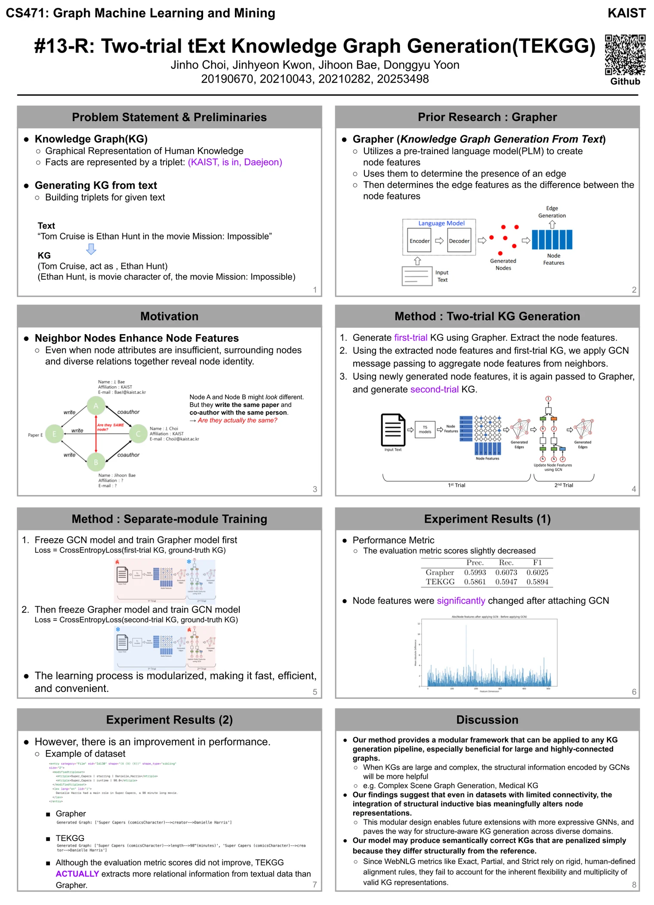

+++
title = "Two-trial tExt Knowledge Graph Generation(TEKGG)"
slug = "two-trial-text-knowledge-graph-generation"
+++

## Summary
Research Project for `KAST CS471 Graph Machine Learning and Mining`

Please check [https://github.com/jinho-choi123/advanced-Grapher/tree/artifact-evaluation](https://github.com/jinho-choi123/advanced-Grapher/tree/artifact-evaluation)

## Poster

