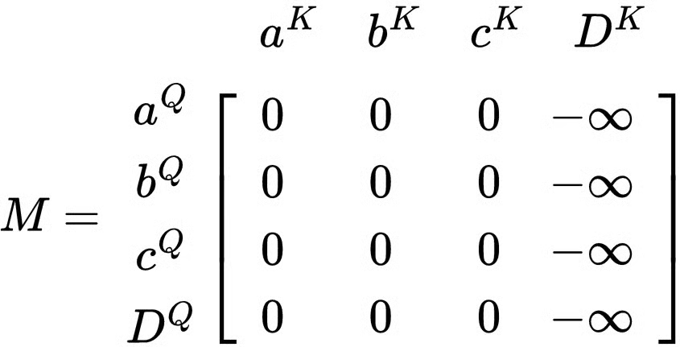
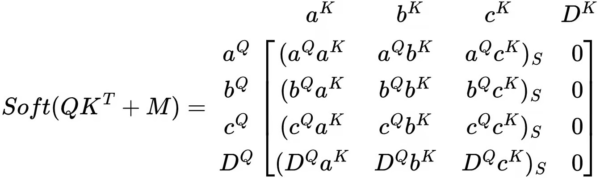
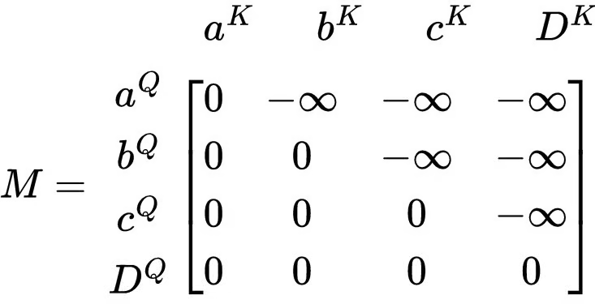

+++
title = "Why do we need a mask in Transformer"
slug = "why-do-we-need-a-mask-in-transformer"
+++

## Introduction
I was working on implementing Transformer Model, and I wondered why we need a mask for Tranformer. In this post, I will talk about why Tranformer needs two types of masks: Padding mask, Look-ahead mask.

## Padding Mask
Let's assume each word takes one embedding vector. (In real, one word can take multiple embedding vectors)

### Padding token
"I am jinho choi"

"I want to work at NVIDA"

These sentences have different length. However, since model has strict rule on matrix shape, they should be made as equal-size tokens. So we add <PAD> tokens. For example, if the max length is 6, then

"I am jinho choi" -> ["I", "am", "jinho", "choi", "<PAD>", "<PAD>"]

"I want to work at NVIDA" -> ["I", "want", "to", "work", "at", "NVIDIA"]

### Padding token has no meaning
Since padding token has no meaning, we should mask it out during applying attention. Applying mask will prevent other words "interact" with the <PAD> token.

The figure below shows the padding mask. a, b, c are all essential words, and D is the padding token.

As a result, if we add the mask to the dot-product, then we can get the following attention weight:

## Look-ahead Mask
We need look-ahead mask at decoder self-attention to give auto-regressive feature to the Tranformer. For example, let's say we are doing translation task. En->Kr

"Hello, my name is jinho choi" -> "안녕, 내 이름은 최진호야"
Decoder will produce the following outputs step-by-step:
1. "안녕"
2. "안녕, 내"
3. "안녕, 내 이름은"
4. "안녕, 내 이름은 최진호야"

Output of previous step is put in to the decoder self-attention layer. However, it is important to block "안녕" word to attend to "이름은" word. ("이름은" can attend to "안녕")

So we add look-ahead mask to the decoder self-attention layer.

