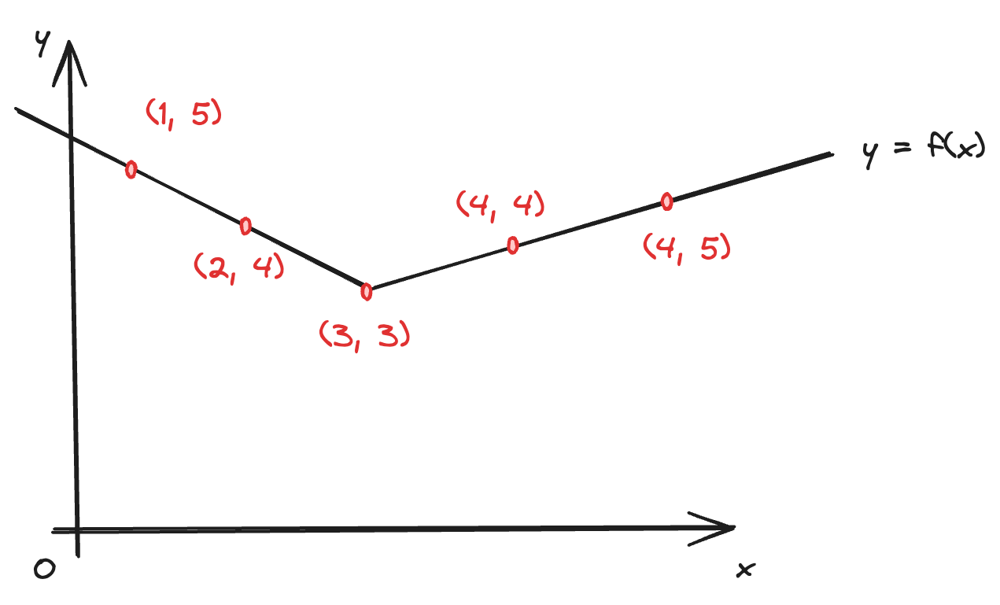

+++
title = "Function Space(Hilbert Space)"
slug = "function-space"
+++

## Summary
Subspace consists of vectors. A function space is an approach to think functions as a vector, and defining a space consisting of functions.

## Functions as Vectors
How can we think a function as a vector?

If we have a function, then we can get the points on the function. If we align all the points(infinite number of points) and make it as a vector, we can think a function as a vector!

$$f(x) \rightarrow(1, 5, 2, 4, 3, 3, 4, 4, 4, 5, ...)$$

## Inner product in function space
How can we calculate the inner product of two functions in function space?

Originally in vector space, we calculate the inner product as follows:
$$v \cdot w = (1, 2) \cdot (3, 4) =1 \cdot3+ 2 \cdot 4=3+8=11$$

For probability measure , inner product of two function is
$$ \left< f, g\right>_\mu = \int_{-\infty }^{\infty } f(x) g(x)d\mu(x)$$

You can easily derive this by thinking a function as a vector.

## Norm in function space
How can we calculate the size of a function in function space?

It is same as calculating the norm in vector space. We are going to use the inner product definition.
In vector space, we calculate the inner product as follows:

$$norm(v)=\sqrt{v\cdot v}$$

As a result, norm in function space is as follows:

$$||f||_{L_2(\mu)}= \lt f, f \gt ^{\frac{1}{2}} _{\mu} $$

## References
[1] [https://m.blog.naver.com/choi_s_h/221749422119](https://m.blog.naver.com/choi_s_h/221749422119)
[2] [https://velog.io/@oldboy818/14%EA%B0%95Function-Space-bnwz7ha1](https://velog.io/@oldboy818/14%EA%B0%95Function-Space-bnwz7ha1)
