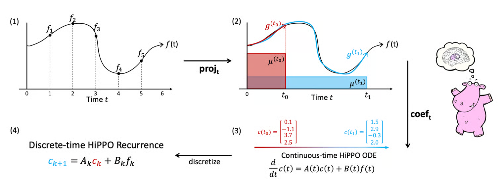
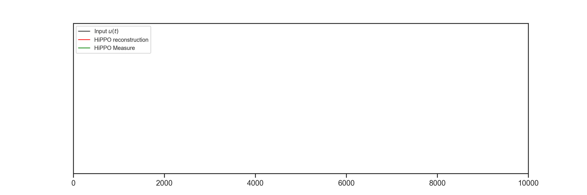

+++
title = "HIPPO Framework"
slug = "hippo"
+++

# Problems

Many of the real-world datas are series data.
For example, sensor datas are time-series data.
Transformer, RNN models use history(previous datas) to predict the next data. However, they suffer from large computation cost(for Transformer) or vanishing gradient(for RNN). The fundamental problem is the memory limitation of storing the history.

HIPPO framework gives a new approach to store previous history with much less memory.

## HIPPO framework overview

Let's say there is a function $f(t)$ that we want to store. At any time $t'$, HIPPO approximates the function $f(t)|_{t \le t'}$

This is done by

1. Define N orthonormal basis $\{ g_n^t \}_{n=0, 1, ..., N-1}$ of function space
2. Project $f(t)$ to each basis, and get the coefficient. (using Hilbert space inner-product)
3. The coefficients can be described as an dynamic system(ODE)
4. If we discretize the ODE, we can get the coefficients for every timestep
5. These coefficients are the compressed information of $f(t)|_{t \le t'}$. Compressed it into N-coefficients per timestep

## General HIPPO Framework

I will not explain the derivation of HIPPO Framework. Please read Appendix C from the original paper or [https://hychiang.info/blog/2024/hippo_matrices/](https://hychiang.info/blog/2024/hippo_matrices/). It shows the math part of deriving ODE for coefficient $c(t)$.

In the Appendix C, it suppose the following equation
$$\begin{aligned}
&\frac{d}{d t} c_n(t) \\\\
&= & \zeta(t)^{-\frac{1}{2}} \lambda_n \int f(x)\left(\frac{\partial}{\partial t} p_n(t, x)\right) \frac{\omega}{\chi}(t, x) \mathrm{d} x +\int f(x)\left(\zeta^{-\frac{1}{2}} \lambda_n p_n(t, x)\right)\left(\frac{\partial}{\partial t} \frac{\omega}{\chi}(t, x)\right) \mathrm{d} x
 \ ...(20) \end{aligned}$$

can be reduced to dynamics of the form

$$\frac{d}{d t} c(t)=-A(t) c(t)+B(t) f(t)$$

This conversion needs some insights.

Since $\frac{d}{dt} P_n^{(t)}$ is a polynomial in $x$ of degree n-1, $\frac{d}{dt} P_n^{(t)}$ can be expressed as linear combination of $P_0, P_1, ..., P_{n-1}$. So the first term in equation (20) can be expressed with $c_0, c_1, ..., c_{n-1}$.

## Question

For many weight function $w$, we can find a scaling function $\chi$ that $\frac{\partial}{\partial t} \frac{\omega}{\chi}$ can be expressed using $\frac{\omega}{\chi}$.

But still I cant think why second term in equation (20) can be expressed as linear combination of $c_0, c_1, ..., c_{N-1}, f$.
If you know the answer, please leave comments!!

## Visualization of HIPPO

As we use higher N(max-degree for orthonormal polynomial basis), it approximates the input $u(t)$ more accurately.

### HIPPO using N=64, measure='legs'

### HIPPO using N=256, measure='legs'

## References

[1] [https://arxiv.org/abs/2008.07669](https://arxiv.org/abs/2008.07669)

[2] [https://hychiang.info/blog/2024/hippo_matrices/](https://hychiang.info/blog/2024/hippo_matrices/)

[3] [https://github.com/state-spaces/s4](https://github.com/state-spaces/s4)

[4] [https://kyujinpy.tistory.com/146](https://kyujinpy.tistory.com/146)

[5] [https://hazyresearch.stanford.edu/blog/2020-12-05-hippo](https://hazyresearch.stanford.edu/blog/2020-12-05-hippo)
