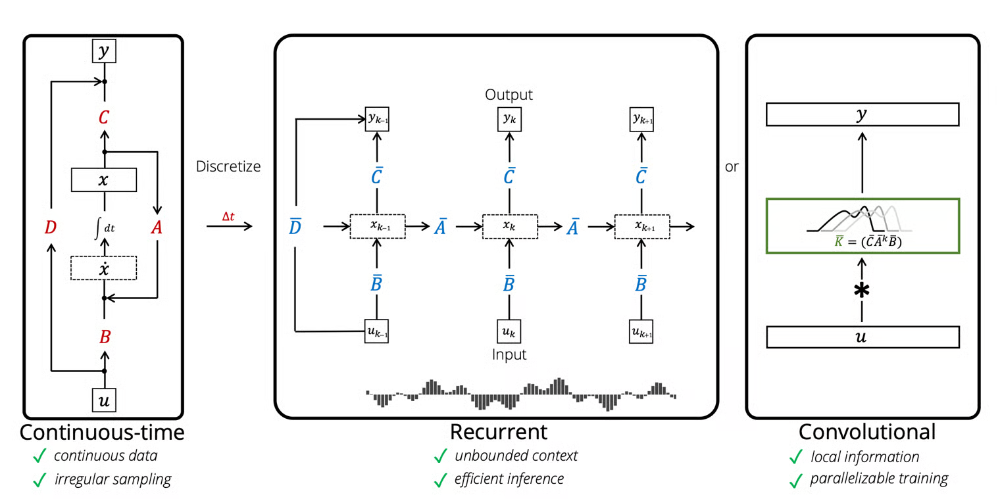
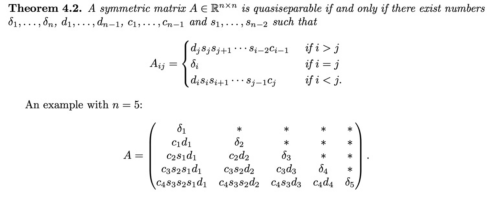

+++
title = "Linear State Space Layer"
slug = "linear-state-space-layer"
+++

[Combining Recurrent, Convolutional, and Continuous-time Models with Linear State-Space Layers](https://arxiv.org/abs/2110.13985)

## Summary
LSSL(Linear State Space Layer) is a model for seq2seq similar to RNN, Transformer. However, it use SSM(State-Space Model) which is different from existing RNNs or Transformers.
LSSL can be viewed as Convolutional and Recurrence. For training time, for parallelization, it is viewed as Convolution. In inference time, it is viewed as Recurrence for online inference.
LSSL Model contains a lot of math. I will not go through all the math. Please read The [Annotated S4 Blog post](https://srush.github.io/annotated-s4/) for more details.

## What is SSM?
SSM(State-Space Model) is a architecture that models input_sequence-output_sequence mapping.

It uses an intermediate hidden state $x(t)$ to store the input history.
$$\begin{aligned}
x^{\prime}(t) & =\boldsymbol{A} x(t)+\boldsymbol{B} u(t) \\\\
y(t) & =\boldsymbol{C} x(t)+\boldsymbol{D} u(t)
\end{aligned}$$

## LSSL(Linear State Space Layer)
LSSL view SSM as Discrete, Convolution and Recurrent.

### SSM as Discrete
Using various discretization method, LSSL view continuous system as discrete.
By default, SSM use Generalized bilinear Transform.

### SSM as Recurrent
Discretized SSM is a form of recurrent.
$$\begin{aligned}
x_t & =\bar{A} x_{t-1}+\bar{B} u_t \\\\
y_t & =C x_t+D u_t
\end{aligned}$$

### SSM as Convolution
I think this is the most interesting part.
If we set the initial state $x_{-1}=0$, then we can express $y_t$ as follows:
$$y_k=C(\bar{A})^k \bar{B} u_0+C(\bar{A})^{k-1} \bar{B} u_1+\cdots+C \overline{A B} u_{k-1}+\bar{B} u_k+D u_k$$

Which is applying kernel $K_L$ to $\{u_i\}_{i=1, 2, ..., k}$ sequence.
$$\mathcal{K} _L (A, B, C)=\left(C A ^i B\right) _{i \in[L]} \in \mathbb{R} ^L =\left(C B, C A B, \ldots, C A ^{L-1} B\right)$$

As a result, for all given inputs $\{u_i\}_{i=1, 2, ..., N}$ we can compute the $y_N$ in parallel.

## LSSL's uniqueness
Previously, I explained about SSM.

What makes LSSL special compared to original SSM?
1. Use HIPPO framework to express latent space $x(t)$
2. Make $K_L$ kernel computation(especially, computing power of $\bar{A}$) efficient

### HIPPO framework with LSSL
The $A$ matrix in SSM takes a key role. In previous SSMs, it used random matrix $A$, which made the model performance bad.
Using $A$ matrix from HIPPO framework made the model remember past input history $\{u_i\}_{i=1, 2, ..., k-1}$ and improved the performance.

### Computing power of $\bar{A}$ more efficient

Paper [Computing with Quasiseparable Matrices](https://arxiv.org/abs/1602.01246) says that MVM(Matrix-Vector Multiplication) for Quasiseperable matrix can be computed efficiently.

So LSSL applies this theorem.
Surprising fact is that matrix  from HIPPO framework is Quasiseperable!

## References
[1] [https://arxiv.org/abs/2110.13985](https://arxiv.org/abs/2110.13985)

[2] [https://srush.github.io/annotated-s4/](https://srush.github.io/annotated-s4/)

[3] [https://velog.io/@euisuk-chung/Structured-State-Space-Models-for-Deep-Sequence-Modeling](https://velog.io/@euisuk-chung/Structured-State-Space-Models-for-Deep-Sequence-Modeling)

[4] [https://www.mat.uniroma2.it/~tvmsscho/Rome-Moscow_School/2011/files/quasisep-fasino-notes.pdf](https://www.mat.uniroma2.it/~tvmsscho/Rome-Moscow_School/2011/files/quasisep-fasino-notes.pdf)
