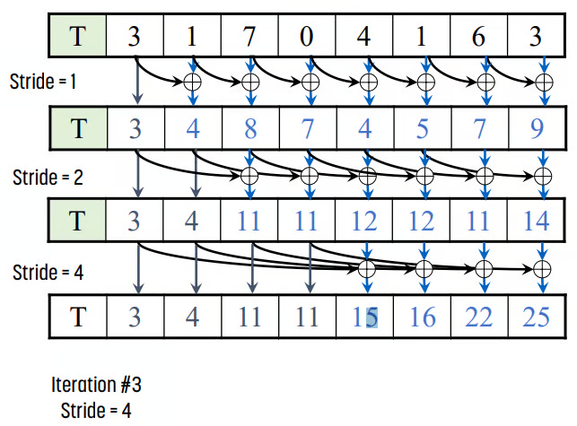

+++
title = "Parallel Scan Algorithm"
slug = "parallel-scan-algorithm"
+++

# What is a scan?

Let's say you have an following input sequence:
$$x_0, x_1, x_2, ..., x_N$$

And you have an binary operator $\otimes $.
$\otimes $ can be a multiplication, addition, subtraction or any other complex operations.

Then the meaning of scanis to calculate the following output for given sequence $\{x_i\}_{i=0, 1, ..., N}$ with binary operator $\otimes$.

$$x_0, x_0\otimes x_1, x_0 \otimes x_1 \otimes x_2, ..., x_0 \otimes x_1 \otimes ... \otimes x_N=\{ x_0 \otimes ... \otimes x_i\}_{i=0, 1, ..., N}$$

This can be easily done using for-loop.
The following code is a simple implementation of scan function.

```python
from typing import List, Callable

def operation(a, b):
    return a + b

def scan(inputs: List[int], op: Callable[[int, int], int]) -> List[int]:
    outputs = []
    for input_ in inputs:
        if len(outputs) == 0:
            outputs.append(input_)
        else:
            last_output = outputs[-1]
            outputs.append(op(last_output, input_))
    return outputs

def main():
    inputs = [1, 2, 3, 4, 5]
    outputs = scan(inputs, operation)
    print(outputs)

if __name__ == "__main__":
    main()
```

## Parallel Scan (Kogge-Stone Algorithm)

There is a parallel algorithm for prefix-sum operation.
Let's say we have input $\{x_i\}_{i=0, 1, ..., N-1}$ and operation $\otimes$.
The pseudo-code for parallel scan algorithm is as follows:

```txt
// Given inputs x[N] and ops
// Assume N = 2**k

Allocate y[N]
Initialize y[N] // y[i] = x[i] for i=0, 1, ..., N-1
stride = 1

while stride <= N:
    Allocate tmp_y[N]

    def thread_func(thread_num):
        tmp_y[thread_num+stride] = ops(y[thread_num], y[thread_num+stride])

    create_threads(N-stride, thread_func) // Generate (N-stride) threads

    y = tmp_y // Copy all the content of tmp_y to y

    Free tmp_y

    stride = stride * 2
```



As a result, the time-complexity will be $O(log(N))$ due to parallel computation. The number of threads won't be a botteneck if we operate this algorithm in GPU or Accelerators.

## References

[1] [https://junstar92.tistory.com/260](https://junstar92.tistory.com/260)

[2] [https://blog.hyelie.com/entry/%EC%9D%B4%EC%A2%85%EB%B3%91%EB%A0%AC%EC%BB%B4%ED%93%A8%ED%8C%85-Parallel-Patterns-Reduction-1](https://blog.hyelie.com/entry/%EC%9D%B4%EC%A2%85%EB%B3%91%EB%A0%AC%EC%BB%B4%ED%93%A8%ED%8C%85-Parallel-Patterns-Reduction-1)
