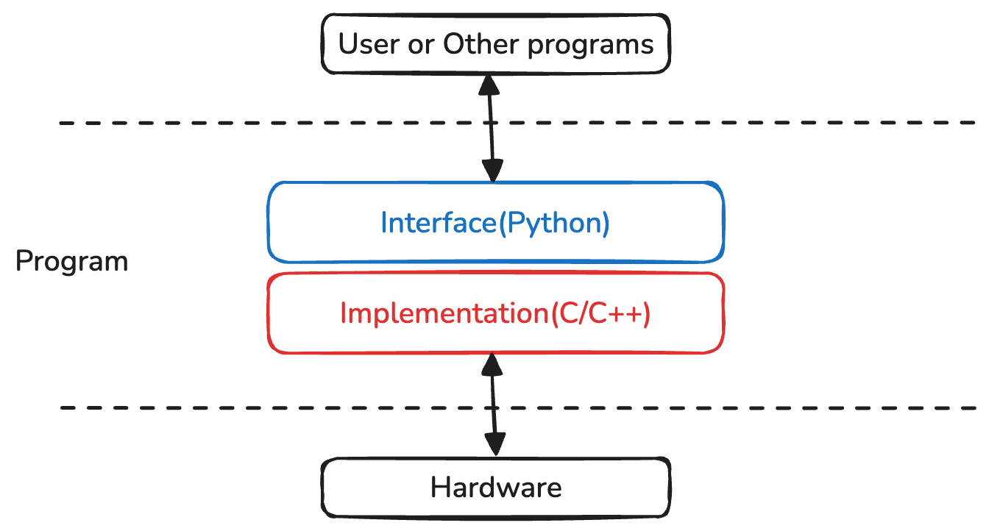

+++
title = "Wrapping C/C++ with Python Interface"
slug = "wrapping-c-with-python"
date = 2025-08-16
+++

## Intro
There are no doubt that programs implemented with C/C++ is usually faster than programs implemented in Python. However, there are some tradeoffs between using C/C++ and Python.

Python is a high-level language, which has better readability. On the otherhand, C/C++ is low-level language with poor readability.

Today's topic is about how to achieve the performance of C/C++ and the readability of Python at the same time.

## Interface as Python, Implementation as C/C++
Program can be divided into two parts: Implementation and Interface

The only part that is exposed is the interface. So if we set the interface with Python language, we can acquire a good readability.

The part that is performance-critical is the implementation(not interface part). As a result, C/C++ consists the implementation for high performance.



## Wrapping
Now we understood that Implementation is C/C++ and Interface is Python. But how we can mixup two different language in a single program.

This is the point where we use `ctypes`, a Python package that can import C/C++ shared library(`hello.so` file).

For example, let's say we implemented a `main` function using C++. And we exported the function as `libhelloworld.so`.

Then we can import the `main` function from `libhelloworld.so` in Python program as follows:
```python
import ctypes

def load_library(slib_path):
    try:
        # Load the shared library
        lib = ctypes.CDLL(slib_path)
        return lib
    except OSError as e:
        print(f"Error loading library {slib_path}: {e}")
        return None

def main():
    slib_path = "build/libhelloworld.so"  # Adjust the path as necessary
    lib = load_library(slib_path)
    if lib:
        # Call a function from the library, e.g., `main`
        try:
            lib.main()
        except AttributeError as e:
            print(f"Function not found in library: {e}")

if __name__ == "__main__":
    main()

```

## Example Code
Checkout the example code base:

[python-ctypes-example](https://github.com/jinho-choi123/python-ctypes-example/)
